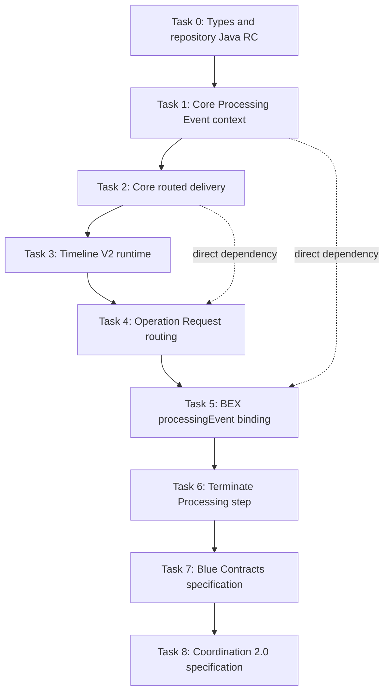

# Coordination V2 Layered Delivery Plan

Status: proposed architecture and ordered implementation specification

Audience: maintainers of `blue-repository`, `blue-repository-java`,
`blue-language-java`, `blue-coordination-java`, and the Blue Contracts and
Coordination specifications

## Objective

Coordination V2 is a layered contract and runtime change. It is not one feature
and must not be delivered as one pull request. The implementation order is:

```text
repository type contract
  -> generated repository Java artifacts
  -> generic Blue Contracts runtime capabilities
  -> Coordination channel and workflow capabilities
  -> end-to-end proof
  -> normative specification consolidation
```

Lower layers must be complete and published before an upper layer consumes
them. Independent changes in the same repository remain separate tasks. In
particular, preserving the Processing Event and supporting routed channel
delivery are two different `blue-language-java` changes, and exposing a BEX
binding and executing Terminate Processing are two different
`blue-coordination-java` changes.

This document defines Tasks 0 through 8. Each task is one independently
reviewable deliverable with its own design, implementation plan, test plan,
review hints, and strict Definition of Done.

## Ordered Task Map

| Task | Owning repository/layer | Deliverable | Entry gate |
| --- | --- | --- | --- |
| 0 | `blue-repository`, `blue-repository-java` | Freeze Coordination V2 types and publish generated Java RC | None |
| 1 | `blue-language-java` | Preserve the immutable Processing Event for one PROCESS run | Task 0 delivery order gate |
| 2 | `blue-language-java` | Add generic routed external-channel delivery | Task 1 delivery order gate |
| 3 | `blue-coordination-java` | Implement Timeline V2 matching and checkpoint semantics | Tasks 0 and 2 published artifacts |
| 4 | `blue-coordination-java` | Route Operation Requests to their effective handler channel | Tasks 2 and 3 |
| 5 | `blue-coordination-java` | Expose `$binding:processingEvent` to Coordination BEX | Tasks 1 and 4 delivery order gate |
| 6 | `blue-coordination-java` | Execute `Coordination/Terminate Processing` | Task 5; Task 4 for full Mandate acceptance |
| 7 | `blue-spec` plus conformance runners | Specify routed delivery in Blue Contracts | Tasks 2 through 6 proven end to end |
| 8 | `blue-spec` Coordination package | Publish Coordination 2.0 specification and fixtures | Task 7 and V2 end-to-end proof |

Tasks 1 and 2 are technically independent core capabilities, but the delivery
sequence remains fixed so one released language baseline is consumed by the
Coordination phase. Tasks 3 and 5 are also not direct code dependencies; they
remain separate and ordered because the plan completes channel/routing
foundations before workflow-host behavior.



## Delivery Rules

1. One task means one focused delivery unit. It normally maps to one pull
   request. A task that necessarily spans repositories, such as Task 0, uses
   linked pull requests with explicit artifact handoff and is complete only
   when every linked change passes. Independent capabilities are never merged
   merely to reduce the pull-request count.
2. A task does not absorb an independent change merely because the same file is
   nearby.
3. Final verification uses published dependency coordinates. Composite builds
   and Maven Local are development aids, not release evidence.
4. Every behavior change has readable fixtures, focused unit tests, integration
   tests at the owning boundary, negative cases, and regression coverage.
5. Changed control flow targets 100% line and branch coverage. Overall project
   coverage must not decrease.
6. Timing tests do not prove laziness or ordering. Use counters, allocation
   instrumentation, deterministic fixtures, or explicit test seams.
7. No task may silently redefine gas, checkpoint, event, or termination
   semantics owned by a lower layer.
8. A task that discovers a required lower-layer change stops and raises a new
   task or blocker. It does not hide that change in an upper-layer pull request.

## Release Gates

- **Contract gate:** Task 0 ends only when RC 4 resolves from the release
  repository and matches the tested aggregate.
- **Language gate:** Tasks 1 and 2 use separate pull requests. After both pass,
  publish one language artifact containing exactly those core capabilities.
- **Coordination gate:** Tasks 3 through 6 use separate pull requests and consume
  only published lower-layer artifacts. Publish the Coordination runtime after
  all four pass together.
- **Specification gate:** Tasks 7 and 8 begin from proven released behavior and
  complete before any stable Coordination V2 claim.

## Shared Vocabulary

| Term | Meaning |
| --- | --- |
| Processing Event | Original generic Blue node supplied to `PROCESS(document, event)`. |
| Current event | Channelized payload currently delivered to a handler; exposed by `event()`, `$event`, and `$binding:event`. |
| Accepting channel | External channel candidate that accepted the Processing Event. |
| Checkpoint channel | Channel key whose checkpoint gates and records one accepted delivery; normally the accepting channel. |
| Effective handler channel | Channel key used for handler discovery after an accepted routed delivery. |
| Logical delivery | One handler-set invocation that may have been accepted through more than one source channel. |

`processingEvent` is the Blue Contracts term and the BEX binding name. Core
Java uses `processEventSource`, `hasProcessEvent()`, and
`frozenProcessEvent()`. No `triggeringEntry` or `triggeringEvent` alias is
introduced. `$event` remains the current channelized payload.

## Work Outside This Plan

The following changes are required for production rollout but belong to
separate plans and repositories:

- MyOS Operation Request production currently writes `allowNewerVersion` and
  assumes the operation's target channel is also the caller's append channel.
  Request production and source-channel selection are separate MyOS tasks.
- `requireExactDocumentVersion` is feeder eligibility against the current
  target document state. It is not a Coordination matcher. MyOS feeder support
  requires its own task and tests.
- Feeder/provider compilation and execution of Mandate validation BEX is a
  separate security-sensitive design.
- PayNote and Payment migration to required `Response.inResponseTo` remains a
  separate consumer project.
- Generic Message/Response consumer migration outside V2 fixtures is not
  hidden in these runtime tasks.
- Runtime enforcement of `Coordination/Actor Policy` is not added here. Task 0
  restores source attribution and Task 3 preserves it; policy execution needs
  its own design if it is to become a supported runtime capability.

These are named blockers, not implicit responsibilities of Tasks 0 through 8.
A production claim that includes exact-version or cross-principal Mandate
authorization cannot be made until the corresponding external work is done.

---

# Task 0: Freeze Types and Publish Repository Java RC

## Goal

Establish one coherent Coordination V2 type contract in `blue-repository`,
regenerate `BlueRepository.blue` without treating the previous aggregate as a
compatibility baseline, generate Java models in `blue-repository-java`, and
publish `blue.repo:blue-repo-java:3.0.0-rc.4`.

Task 0 is the only task allowed to change repository type definitions in this
plan. Later tasks consume the published contract and do not carry local model
copies.

## Design

The release must contain these contract decisions:

- `Timeline Entry` has required `timeline`, `sequence`, `timestamp`, `actor`,
  and `message`.
- `sequence` is strictly increasing and authoritative within one timeline.
- timestamps may repeat; they support cross-timeline ordering and completeness
  windows but do not establish a unique total intra-timeline order.
- optional `source` records provider-authenticated submission provenance.
- optional `onBehalfOf` carries Mandate-backed authority for feeder validation.
- `Timeline Channel` has required `timeline` and `actor` bindings.
- Composite and All Timelines channels have no actor or timeline of their own;
  they are union channels over Timeline Channel children.
- `Operation Request.channel` is the required effective target channel.
- `requireExactDocumentVersion` is described as feeder eligibility.
- `Operation.channel` is the effective handler channel, not necessarily the
  accepting source channel.
- `Message.inResponseTo` remains temporarily untyped with a precise TODO that
  the expected type is `Coordination/Message` and the blocker is generator
  cyclic-dependency support.
- `Response.inResponseTo` is a required `Coordination/Request`.
- Mandate BEX reads `$binding:processingEvent`, uses
  `processingEventTimestamp`, and contains no triggering alias or hardcoded
  Timeline Entry BlueId.
- Mandate includes the generated `Coordination/Terminate Processing` step.
- no local `Blue/BEX Program` type is defined; BEX program shape is described
  by convention and consumed as a known runtime value.
- removed Permission types and their invalid/error variants do not reappear.

Breaking stable definitions require deleting the old generated
`BlueRepository.blue` before regeneration. The source `.blue` files are the
contract; the aggregate is generated output.

`blue-repository-java` must generate from that exact aggregate. Generated
models, constants, manifest, resources, type aliases, and historical metadata
must all describe the same repository version. No hand-authored generated Java
patch is allowed.

## Implementation Plan

1. Audit every changed V2 source type against the approved architecture and
   check descriptions for ownership, optionality, equality, and runtime-layer
   claims.
2. Delete the old `BlueRepository.blue` and run the repository generator in
   write mode.
3. Run generator check mode from the new aggregate and confirm the RepoBlueId
   is stable across a second generation.
4. Point `blue-repository-java` generation at the exact local aggregate using
   `-PblueRepositorySource`.
5. Run `generateRepositorySources`, review all generated model/API changes, and
   run `verifyGeneratedSources`.
6. Add or update generated-model contract tests for every field used by Tasks 3
   through 6.
7. Run the full repository-Java build and a clean external consumer smoke test.
8. Publish `3.0.0-rc.4`, resolve it from the release repository, and compare the
   published resource/manifest with the locally verified artifact.

## Test Plan

### Repository Generator Cases

1. `regeneratesFromMissingAggregate`
   - A deleted aggregate is recreated successfully from source definitions.

2. `secondGenerationIsByteStable`
   - A second check/write cycle produces no diff and the same RepoBlueId.

3. `allQualifiedReferencesResolve`
   - Every non-primitive reference resolves, including Mandate and Coordination
     cycles supported by the generator.

4. `messageCycleWorkaroundIsExplicit`
   - `Message.inResponseTo` is untyped and its TODO names the expected type and
     exact generator limitation.

5. `repositoryContainsNoLocalBexProgramType`
   - Neither `BEX Program` nor `Blue/BEX Program` is declared locally.

6. `removedPermissionTypesStayRemoved`
   - Source and aggregate searches contain none of the deleted type names.

7. `mandateProgramUsesProcessingEventOnly`
   - Embedded source contains `processingEvent` and
     `processingEventTimestamp`; no triggering aliases exist.

### Generated Java Cases

1. `timelineEntryHasV2Fields`
   - Generated accessors have exact types and optionality for timeline,
     sequence, timestamp, actor, source, onBehalfOf, and message.

2. `timelineChannelHasTimelineAndActor`
   - No legacy `timelineId` accessor is generated for the V2 type.

3. `operationRequestHasRequiredEffectiveChannel`
   - Generated model exposes channel, document, exact-version flag, and request.

4. `terminateProcessingModelResolves`
   - Qualified name, BlueId annotation, optional reason, and subtype relation
     are correct.

5. `repositoryResourcesMatchManifest`
   - Every generated type BlueId and resource path agrees with the manifest.

6. `releasedArtifactWorksInCleanConsumer`
   - A temporary Gradle project resolves RC 4 remotely, loads the repository,
     resolves the critical types, and deserializes representative YAML.

### Quality Gates

- `git diff --check` passes in both repositories.
- Repository generator check mode passes after generation.
- `./gradlew verifyGeneratedSources` and `./gradlew clean build` pass.
- Generated output is reviewed by qualified type and behavior, not accepted as
  an opaque bulk diff.

## Code Review Hints

Reviewers should verify:

- descriptions do not assign feeder work to the processor or processor work to
  the provider;
- required versus optional fields match the architecture;
- sequence and timestamp semantics are not conflated;
- union channels do not gain their own actor;
- source attribution is passive provenance, not authority;
- effective target channel and accepting source channel remain distinct;
- the aggregate was rebuilt from a missing baseline;
- generated Java sources were not manually edited;
- the published artifact is exactly the tested artifact;
- unrelated PayNote/Payment migrations are absent.

## Strict Definition of Done

- [ ] All approved V2 source definitions and descriptions are internally
      consistent.
- [ ] `BlueRepository.blue` regenerates deterministically from a missing file.
- [ ] Generator check mode reports the aggregate up to date.
- [ ] All critical V2 types resolve by qualified name and BlueId.
- [ ] Generated Java classes expose the exact V2 field surface.
- [ ] Embedded Mandate BEX uses `processingEvent` only.
- [ ] `TerminateProcessing` is present in generated Java and resources.
- [ ] No local BEX Program or removed Permission type exists.
- [ ] Repository-Java generation verification and full build pass.
- [ ] A clean consumer resolves and exercises published `3.0.0-rc.4`.
- [ ] The pull request contains no language or Coordination runtime changes.

---

# Task 1: Preserve Processing Event Context in Core

## Goal

Add one generic, immutable, execution-scoped view of the original Processing
Event to `blue-language-java`, without changing current-event, channel,
checkpoint, queue, or gas behavior.

This task provides only the core context API. It does not add a BEX binding.

## Design

Blue Contracts already names the input to `PROCESS(document, event)` the
Processing Event and requires it to be read-only. `ProcessorEngine.Execution`
must retain that original input for the lifetime of the PROCESS run.

Normative Java names:

```java
private final Node processEventSource;

public boolean hasProcessEvent();
public FrozenNode frozenProcessEvent();
```

`processEventSource` is nullable for explicit INITIALIZE. Both PROCESS entry
points retain the original preprocessed event reference. Implicit
initialization inside PROCESS uses the same `Execution` and therefore the same
Processing Event.

The immutable snapshot is lazy and memoized:

```text
unused: retain one O(1) read-only Node reference
first access: freeze O(size of Processing Event)
later access in same run: return the same FrozenNode instance
```

Use an explicit state that distinguishes uninitialized, absent, ready, and
failed snapshot outcomes. A failed snapshot is not retried repeatedly.
`hasProcessEvent()` must never trigger freezing.

`ProcessorExecutionContext` exposes narrow delegates only. It does not expose
the mutable source reference. Existing `event()` remains the current
channelized payload and continues to use existing cloning/protection behavior.

The lazy design relies on the existing synchronous PROCESS contract: callers
must not mutate the input event while processing is active. Supporting
concurrent caller mutation would require an eager copy and is not part of this
task.

## Implementation Plan

1. Add the nullable source and memoized snapshot state to
   `ProcessorEngine.Execution`.
2. Pass the Processing Event into both PROCESS construction paths and null into
   explicit INITIALIZE paths.
3. Implement one clearly synchronized snapshot slow path.
4. Add `hasProcessEvent()` and `frozenProcessEvent()` to
   `ProcessorExecutionContext` with Javadoc distinguishing them from `event()`.
5. Add a narrow package-private test seam that counts snapshot construction
   without exposing production mutability.
6. Add focused execution-context tests and broad processor regressions.
7. Run allocation/performance checks for unused and used access.
8. Publish a language artifact after Task 2 is also complete; do not expose a
   sibling-source dependency as final evidence.

## Test Plan

1. `explicitInitializeHasNoProcessEvent`
   - Presence is false and frozen value is null.

2. `processRetainsOriginalEvent`
   - Presence is true and the snapshot equals the original preprocessed input.

3. `implicitInitializationSharesProcessEvent`
   - Initialization lifecycle handlers in PROCESS see the root input.

4. `directAndTriggeredHandlersShareOneSnapshot`
   - Current events differ; `frozenProcessEvent()` is the same instance.

5. `multiHopTriggeredHandlersKeepRootContext`
   - Two or more emitted-event hops retain the original event.

6. `embeddedScopesKeepRootContext`
   - Root and child scopes share Processing Event context for one run.

7. `bridgedHandlersKeepRootContext`
   - Bridge payload behavior is unchanged while the root input survives.

8. `channelAdaptationDoesNotReplaceProcessEvent`
   - A projected channel payload becomes `event()` but not the root context.

9. `handlerEventMutationCannotMutateProcessEvent`
   - Mutating a handler-local event copy has no effect on the frozen root.

10. `separateProcessRunsDoNotLeakContext`
    - Reusing a processor cannot expose an earlier invocation's input.

11. `hasProcessEventDoesNotFreeze`
    - Repeated presence checks leave the freezer invocation count at zero.

12. `unusedContextHasConstantAllocation`
    - Small and large events produce event-size-independent retained overhead.

13. `firstAccessFreezesOnce`
    - Many contexts and calls invoke the freezer once.

14. `snapshotFailureIsStable`
    - Failure category/message is stable and traversal is not retried.

15. `currentProcessorBehaviorIsUnchanged`
    - Initialization, external channels, checkpoints, triggers, bridges,
      embedded scopes, gas, and termination suites remain green.

## Code Review Hints

Reviewers should verify:

- state belongs to `Execution`, not a scope, queue, handler, or static holder;
- no Coordination type or BlueId appears in core;
- no mutable source accessor exists;
- `hasProcessEvent()` is genuinely O(1);
- snapshot creation is lazy, memoized, and failure-safe;
- explicit and implicit initialization differ correctly;
- `event()` and all channelized payload behavior are untouched;
- tests prove laziness using counters or allocation evidence, not elapsed time;
- no BEX dependency or binding is introduced.

## Strict Definition of Done

- [ ] Core exposes exactly `hasProcessEvent()` and `frozenProcessEvent()`.
- [ ] The retained field is generic and named `processEventSource`.
- [ ] Explicit INITIALIZE has no Processing Event.
- [ ] Every handler in one PROCESS run can reach the same immutable snapshot.
- [ ] Unused context performs no event-sized traversal or allocation.
- [ ] Used context freezes at most once.
- [ ] Direct, triggered, multi-hop, bridge, embedded, mutation, and cross-run
      tests pass.
- [ ] Existing current-event, channel, checkpoint, gas, and termination behavior
      remains unchanged.
- [ ] Changed code has 100% line and branch coverage and the project clean build
      passes.
- [ ] No routed-delivery or Coordination BEX code is included.

---

# Task 2: Add Routed External-Channel Delivery to Core

## Goal

Allow a trusted external Channel processor to accept a Processing Event through
one channel while dispatching handlers bound to a different same-scope channel,
without transferring checkpoint ownership or executing the same logical route
more than once.

This is a generic Blue Contracts capability. It contains no Operation Request,
Timeline, actor, or Mandate knowledge.

## Design

Current `ChannelRunner` uses one channel key for acceptance, checkpointing, and
handler discovery. `ChannelDelivery` already separates a possible
`checkpointKey`; it must additionally support:

```text
handlerChannelKey  optional same-scope effective handler channel
logicalDeliveryKey optional deterministic deduplication key
```

Existing factories and deliveries remain source-compatible. If
`handlerChannelKey` is absent, handlers are discovered under the accepting
channel exactly as today. If `logicalDeliveryKey` is absent, no new
cross-candidate deduplication is implied.

For a routed delivery:

1. the accepting Channel processor validates and accepts the original event;
2. checkpoint newness and duplicate checks run against the accepting or
   explicitly supplied checkpoint key;
3. core validates that the handler channel exists as a supported channel in the
   same `ContractBundle` and scope;
4. core discovers handlers under the handler channel without re-evaluating that
   channel as an external source candidate;
5. `HandlerMatchContext.channelKey()` is the handler channel;
6. handler `$event` remains the delivery payload selected by the accepting
   channel;
7. a successful logical route is recorded for this `Execution` only;
8. later eligible source candidates with the same logical route skip handler
   execution but may persist their own checkpoints after the shared delivery
   succeeded.

The deduplication identity is:

```text
(scopePath, Processing Event identity, handlerChannelKey, logicalDeliveryKey)
```

The Processing Event identity is computed by core using the existing
checkpoint identity machinery. A Channel processor supplies only a stable
domain route key. It must not duplicate the full event hash algorithm.

Logical delivery state is marked successful only after handlers and buffered
effects complete and the scope remains active. Fatal or graceful termination
does not mark success and does not advance later source checkpoints. A stale
source candidate neither invokes handlers nor advances its checkpoint, even if
another source delivered the same logical route.

Gas remains deterministic:

- each external candidate match and checkpoint evaluation is charged as today;
- one successful logical route pays handler discovery/execution/effect gas once;
- deduplicated source candidates do not pay a second handler overhead;
- no new BEX charge is introduced.

## Implementation Plan

1. Extend immutable `ChannelDelivery` API with routed-delivery metadata while
   preserving current factories.
2. Preserve new fields through `ChannelEvaluation` and internal copy paths.
3. Add same-scope handler-channel validation to `ChannelRunner`.
4. Separate checkpoint key from handler-discovery key throughout delivery
   execution.
5. Add execution-scoped successful logical-delivery tracking.
6. Define the exact point at which a route becomes successful.
7. Preserve current termination and checkpoint-persist ordering.
8. Add metrics for routed and deduplicated deliveries without unbounded labels.
9. Add conformance-style fixtures and focused unit/integration tests.
10. Run exact gas regression tests, mutation checks, and full build.
11. Publish a language release containing Tasks 1 and 2.

## Test Plan

### Compatibility Cases

1. `ordinaryDeliveryUsesAcceptingChannelForHandlers`
   - Every existing API path behaves byte-for-byte as before.

2. `ordinaryDeliveryKeepsExistingCheckpointKey`
   - No routed metadata changes checkpoint state or gas.

3. `deliveryCopiesPreserveRoutingMetadata`
   - Public accessors and internal copy paths retain exact values.

### Routed Cases

1. `routesToSameScopeHandlerChannel`
   - Source channel accepts; only target-channel handlers run.

2. `handlerContextReportsEffectiveChannel`
   - Matchers observe the handler channel and original delivery payload.

3. `sourceChannelOwnsCheckpoint`
   - Target channel checkpoint is untouched.

4. `explicitCheckpointKeyStillWins`
   - Composite/custom channel checkpoint semantics remain supported.

5. `unknownHandlerChannelTerminatesDeterministically`
   - No handler or checkpoint runs/persists.

6. `nonChannelTargetTerminatesDeterministically`
   - A contract key that is not a supported Channel is rejected.

7. `targetCannotEscapeCurrentScope`
   - Embedded/root keys cannot route across scope boundaries.

8. `targetChannelIsNotReevaluatedAsSource`
   - Its external matcher and source checkpoint are not invoked.

### Deduplication and Failure Cases

1. `multipleSourcesInvokeLogicalRouteOnce`
   - Two eligible candidates with the same route key execute one handler set.

2. `successfulDuplicateSourcesAdvanceOwnCheckpoints`
   - Both eligible source checkpoints record successful consumption.

3. `staleDuplicateSourceDoesNotAdvance`
   - A stale source remains unchanged even after another source succeeds.

4. `differentLogicalKeysDoNotDeduplicate`
   - Same event and target with distinct route keys invoke separately.

5. `missingLogicalKeyPreservesLegacyMultipleDelivery`
   - Core does not guess domain identity.

6. `differentScopesDoNotDeduplicate`
   - Identical keys in root and child are isolated.

7. `handlerFailureMarksNoLogicalSuccess`
   - No involved source checkpoint is persisted after fatal execution.

8. `gracefulTerminationMarksNoLogicalSuccess`
   - Existing no-checkpoint-on-termination behavior remains intact.

9. `laterCandidateAfterSuccessfulRouteDoesNotChargeHandlerAgain`
   - Exact gas and metrics prove one handler dispatch.

10. `replayAfterCommittedCheckpointsRunsNothing`
    - A later PROCESS invocation rejects the consumed event through source
      checkpoints; execution-scoped dedup state does not leak.

### Quality Gates

- Exact gas totals are asserted for ordinary, routed, duplicate, stale, fatal,
  and graceful cases.
- Deliberately remove route deduplication; the multiple-source test must fail.
- Deliberately use handler channel as checkpoint key; checkpoint ownership tests
  must fail.
- Existing Blue Contracts conformance suite remains green.

## Code Review Hints

Reviewers should verify:

- the core API is domain-neutral;
- accepting, checkpoint, and handler keys are never conflated;
- target validation is same-scope and must-understand;
- target external matching is not bypassed accidentally because it is not run
  at all; route authority comes from the trusted accepting Channel processor;
- logical success is recorded only after handler effects succeed;
- duplicate source checkpoints advance only when their own newness gate passes;
- execution-scoped dedup state cannot leak between PROCESS calls;
- current factories and non-routed gas remain source/behavior compatible;
- no Coordination classes, type names, or BlueIds appear in core.

## Strict Definition of Done

- [ ] `ChannelDelivery` represents handler and logical-delivery routing without
      breaking existing callers.
- [ ] Same-scope target validation is deterministic and tested.
- [ ] Checkpoint ownership remains with the source/checkpoint channel.
- [ ] Handler discovery and match context use the effective handler channel.
- [ ] Multiple eligible source channels execute one declared logical route.
- [ ] Failure, graceful termination, staleness, replay, and nested scopes have
      explicit coverage.
- [ ] Ordinary delivery behavior and exact gas are unchanged.
- [ ] Routed gas and metrics are deterministic and bounded.
- [ ] Changed control flow has 100% line/branch coverage.
- [ ] Full build and existing conformance suites pass.
- [ ] A released language artifact containing Tasks 1 and 2 is available before
      Task 3 begins.
- [ ] No Timeline or Operation Request implementation is included.

---

# Task 3: Implement Timeline V2 Runtime Semantics

## Goal

Migrate `blue-coordination-java` Timeline channels from V1 `timelineId` and
timestamp recency to V2 timeline/actor identity and sequence-based checkpoint
semantics, including correct Composite and All Timelines union behavior.

This task does not implement Operation Request routing or BEX host bindings.

## Design

`Timeline Channel` accepts a Timeline Entry only when:

- the event is a conforming Timeline Entry;
- required timeline, actor, sequence, timestamp, and message are present and
  correctly typed;
- channel timeline equals entry timeline under semantic Blue identity;
- channel actor equals entry actor under semantic Blue identity.

Semantic identity must treat a pure BlueId reference and its equivalent
materialized value as equal. Pattern/subtype matching is not equality and must
not be substituted.

Same-timeline newness is:

```text
same full event identity -> duplicate
current.sequence > previous.sequence -> newer
current.sequence <= previous.sequence -> stale or equivocation
timestamp -> not used for same-timeline recency
```

Parse sequence as `BigInteger`; do not truncate to `long`. Timestamp remains
available for feeder cross-timeline ordering/completeness and domain lifecycle
timestamps.

Composite and All Timelines channels are union candidates:

- they have no actor or timeline of their own;
- child Timeline Channels provide eligibility predicates;
- several matching children produce one union delivery in deterministic
  `(order, key)` order;
- the union owns its own checkpoint under the union key;
- child checkpoints used by direct subscriptions are independent and must not
  gate the union;
- direct child and union handlers are different subscriptions and may both run.

Optional source is preserved in the event payload. This task does not invent
Actor Policy execution.

## Implementation Plan

1. Update generated-model dependencies to RC 4 and the released language
   artifact from Task 2.
2. Replace legacy timelineId extraction/matching in
   `TimelineProviderSupport`, `TimelineChannelProcessor`, and event helpers.
3. Add one reusable semantic-identity helper using established Blue APIs.
4. Parse and compare sequence as `BigInteger`.
5. Keep full event identity duplicate checks in core checkpoints.
6. Remove timestamp-based same-timeline recency.
7. Refactor Composite and All Timelines evaluation to use children only for
   eligibility and the union key for checkpointing.
8. Remove child-checkpoint coupling and define deterministic matching-child
   metadata.
9. Migrate test builders, YAML fixtures, examples, and generated-model tests.
10. Run targeted suites, mutation checks, and full build.

## Test Plan

1. `matchingTimelineAndActorAccept`
2. `sameTimelineDifferentActorRejectsWithoutCheckpoint`
3. `sameActorDifferentTimelineRejectsWithoutCheckpoint`
4. `pureReferenceEqualsEquivalentMaterializedBinding`
5. `sameTypeDifferentContentDoesNotEqual`
6. `equalTimestampHigherSequenceAccepts`
7. `higherTimestampLowerSequenceRejects`
8. `lowerTimestampHigherSequenceUsesSequence`
9. `exactEventReplayIsDuplicate`
10. `differentContentAtCheckpointedSequenceRejectsAsEquivocation`
11. `sequenceBeyondLongRangeRemainsExact`
12. `missingTimelineRejectsWithoutCheckpoint`
13. `missingActorRejectsWithoutCheckpoint`
14. `missingOrInvalidSequenceRejectsWithoutCheckpoint`
15. `missingOrInvalidTimestampRejectsWithoutCheckpoint`
16. `missingMessageRejectsWithoutCheckpoint`
17. `optionalSourceSurvivesDeliveryUnchanged`
18. `compositeWithSeveralMatchingChildrenDeliversOnce`
19. `allTimelinesWithSeveralMatchingChildrenDeliversOnce`
20. `unionCheckpointIsIndependentFromChildCheckpoint`
21. `childCheckpointIsIndependentFromUnionCheckpoint`
22. `directChildAndUnionHandlersMayBothRun`
23. `matchingChildSelectionIsDeterministic`
24. `newUnionWithNoCheckpointCanBackfillIndependently`

Use fixture names that state timeline, actor, timestamp, and sequence explicitly
so failures are readable. Deliberately restore timestamp recency; equal-time
higher-sequence tests must fail. Deliberately consult child checkpoints from a
union; independence tests must fail.

## Code Review Hints

Reviewers should verify:

- equality uses Blue value identity, not type matching or Java object identity;
- no required field fails open;
- `BigInteger` survives every parsing/comparison path;
- timestamp is not consulted for same-timeline newness;
- full event identity still handles exact replay;
- unions have no actor and own their checkpoints;
- child checkpoint state cannot suppress a union delivery;
- source is preserved but not treated as authority;
- feeder ordering/completeness behavior is not moved into Coordination.

## Strict Definition of Done

- [ ] All V2 required Timeline fields are parsed and validated.
- [ ] Timeline and actor semantic equality is proven for reference/materialized
      forms and negative cases.
- [ ] Same-timeline recency uses exact sequence only.
- [ ] Duplicate, stale, equivocation, and huge sequence cases pass.
- [ ] Composite/All unions deliver once and own independent checkpoints.
- [ ] Existing direct and embedded Timeline workflows are migrated and green.
- [ ] Changed code has 100% line/branch coverage; overall coverage does not
      decrease.
- [ ] Full build passes against published RC 4 and language artifacts.
- [ ] No Operation Request routing, BEX binding, or termination step is included.

---

# Task 4: Route Operation Requests to Effective Channels

## Goal

Use Task 2's generic routed-delivery primitive so a V2 Operation Request can be
accepted through an eligible source Timeline Channel and invoke handlers bound
to its required effective target channel exactly once.

## Design

For a Timeline Entry carrying `Coordination/Operation Request`:

```text
accepting/checkpoint channel = Timeline channel whose timeline + actor match
effective handler channel   = message.channel
handler payload              = full Timeline Entry
logical delivery key         = deterministic Operation Request route identity
```

The target channel is not re-evaluated as an external source. It is a same-scope
handler binding validated by core. Source eligibility was established by the
accepting Timeline Channel. Feeder validation remains responsible for Mandate
authority and exact document-version eligibility.

The Coordination logical route key must be deterministic from immutable request
semantics, for example operation key and target channel, while core combines it
with Processing Event identity and scope. It must not include accepting channel
identity, or duplicate source bindings would fail to deduplicate.

Non-Operation messages retain normal Timeline delivery. A direct request whose
source and target keys are equal uses the same routed path and semantics; do not
maintain two subtly different matchers.

`OperationRequestMatcher` must:

- require the operation name to equal the operation contract key;
- require request channel to equal the current effective handler channel;
- validate request payload against the declared request pattern;
- retain any explicit event pattern behavior;
- remove `allowNewerVersion` parsing and initialization-marker comparison;
- not implement `requireExactDocumentVersion`.

Composite/All source candidates propagate the child's accepted route metadata
while retaining the union's checkpoint key. If a direct child and a union both
route the same request to the same target, core logical-delivery deduplication
executes the target handler set once while each eligible source subscription
keeps its own checkpoint semantics.

## Implementation Plan

1. Add V2 Operation Request extraction for bare requests and Timeline Entry
   messages.
2. Have Timeline Channel evaluation create routed `ChannelDelivery` metadata
   only after normal timeline/actor acceptance.
3. Propagate routes through Composite and All Timelines union evaluation.
4. Derive one stable logical route key independent of source binding.
5. Update `OperationRequestMatcher` for required request channel and effective
   handler context.
6. Delete `allowNewerVersion`, initialization-marker, and stale imports/tests.
7. Keep `requireExactDocumentVersion` data passive inside the processor.
8. Update diagnostics and bounded metrics.
9. Add direct, cross-channel, union, failure, and replay fixtures.
10. Run targeted and full builds against published lower-layer artifacts.

## Test Plan

1. `directRequestRoutesToDeclaredChannel`
2. `crossChannelRequestRunsTargetOperation`
3. `sourceTimelineMismatchRejectsBeforeRouting`
4. `sourceActorMismatchRejectsBeforeRouting`
5. `requestChannelMustExistInSameScope`
6. `requestChannelMustEqualOperationHandlerChannel`
7. `missingRequestChannelRejectsWithoutCheckpoint`
8. `blankRequestChannelRejectsWithoutCheckpoint`
9. `unknownOperationDoesNotRunHandler`
10. `requestPayloadMustMatchOperationShape`
11. `bareOperationRequestUsesSameEffectiveChannelRules`
12. `ordinaryTimelineMessageKeepsNormalDelivery`
13. `directChildAndCompositeRouteInvokeTargetOnce`
14. `severalMatchingSourceChannelsInvokeTargetOnce`
15. `eligibleDuplicateSourcesPersistOwnCheckpoints`
16. `staleSourceDoesNotPiggybackOnSuccessfulRoute`
17. `targetHandlerFailurePersistsNoSourceCheckpoint`
18. `targetGracefulTerminationPersistsNoSourceCheckpoint`
19. `targetExternalMatcherIsNotInvoked`
20. `targetHandlerSeesFullTimelineEntryAndEffectiveChannel`
21. `allowNewerVersionHasNoProductionReference`
22. `exactVersionFlagDoesNotConsultInitializationMarker`
23. `replayAfterCommittedSourceCheckpointsRunsNothing`

Include one fixture where Alice's entry is accepted by `aliceChannel`, names
`bobChannel` as target, and invokes a handler bound to `bobChannel`. A fail-open
implementation that simply ignores actor matching must fail the negative source
tests.

## Code Review Hints

Reviewers should verify:

- source Timeline eligibility always runs before route creation;
- handler target is taken from required request channel, not recipientChannel or
  accepting channel;
- the route key is source-independent and deterministic;
- target channel is never used as checkpoint owner;
- Composite/All propagation preserves union checkpoint ownership;
- direct and cross-channel requests share one implementation path;
- no initialization marker is used as current-document state;
- no feeder/Mandate authority logic is invented in Coordination;
- tests prove one logical execution under multiple matching sources.

## Strict Definition of Done

- [ ] Required Operation Request channel controls effective handler discovery.
- [ ] Cross-channel requests preserve source acceptance and checkpoint ownership.
- [ ] Direct, Composite, and All Timelines sources route correctly.
- [ ] Multiple sources execute one logical target delivery.
- [ ] Missing/unknown/mismatched channels fail deterministically.
- [ ] Request payload and operation-key matching remain exact.
- [ ] `allowNewerVersion` and initialization-marker version logic are removed.
- [ ] `requireExactDocumentVersion` remains a documented feeder boundary.
- [ ] Failure, termination, stale, replay, and gas behavior is tested.
- [ ] Changed code has 100% line/branch coverage and full build passes.
- [ ] No BEX binding or Terminate Processing executor is included.

---

# Task 5: Expose the Processing Event to Coordination BEX

## Goal

Expose Task 1's immutable core context as
`$binding:processingEvent` in every Coordination Compute execution during one
PROCESS run, while preserving O(1) overhead when the binding is unused.

## Design

`BexWorkflowContextFactory` currently binds current event, current contract, and
steps. It adds one host binding:

```java
BexValue processingEvent = processorContext.hasProcessEvent()
        ? DeferredBexValue.memoized(() ->
                BexValues.frozen(processorContext.frozenProcessEvent()))
        : BexValues.undefined();
```

`$event` and `$binding:event` remain the current channelized payload.
`$binding:processingEvent` remains the root input across direct, initialization,
triggered, multi-hop, bridge, and embedded-scope handlers. Explicit INITIALIZE
exposes undefined.

The host binding is generic. It contains the complete Processing Event and does
not hardcode or validate a Timeline Entry BlueId. Mandate BEX may check that the
value is an object and `/timestamp` is an integer before interpreting it.

A package-private `DeferredBexValue` in `blue-coordination-java` may implement
the lazy bridge. It must delegate the complete `BexValue` interface, evaluate
once on first semantic access, memoize undefined and failure outcomes, and
return the materialized delegate for an empty path.

If a reusable lazy value is proposed for `blue-bex-java`, that is a separate
BEX-library task and must not be smuggled into this pull request. The local
adapter is preferred until broader reuse is demonstrated.

Gas is unchanged. Binding reads pay existing `varRead`; output operations pay
existing value-size charges. Host snapshot construction receives no invented
gas charge. Eager and deferred values must produce identical BEX results and gas
boundaries.

## Implementation Plan

1. Add and unit-test the host-local deferred BEX adapter.
2. Bind `processingEvent` in `BexWorkflowContextFactory` without materializing
   it during context construction.
3. Keep explicit INITIALIZE binding undefined.
4. Add fixtures where current event and Processing Event contain deliberately
   different values.
5. Add real RC 4 Mandate lifecycle fixtures using timestamp `7000001`.
6. Add allocation and gas-equivalence tests.
7. Run all Compute/BEX regressions and full build.

## Test Plan

1. `directComputeReadsCompleteProcessingEvent`
2. `triggeredComputeDistinguishesEventFromProcessingEvent`
3. `multiHopComputeKeepsOriginalProcessingEvent`
4. `implicitInitializationCanReadProcessingEvent`
5. `explicitInitializationReadsUndefined`
6. `embeddedScopeReadsRootProcessingEvent`
7. `bridgeHandlerReadsRootProcessingEvent`
8. `nonTimelineScalarListAndObjectEventsAreSupported`
9. `missingTimestampRemainsUndefined`
10. `invalidTimestampKindFailsMandateGuard`
11. `unusedBindingDoesNotInvokeSupplier`
12. `manyReadsInvokeSupplierOnce`
13. `deferredUndefinedMatchesEagerUndefined`
14. `deferredScalarListObjectAndNodeDelegationIsComplete`
15. `deferredFailureIsMemoized`
16. `deferredAndEagerProgramsUseExactSameGas`
17. `largeUnusedEventHasConstantContextCreationCost`
18. `largeUsedEventFreezesOncePerProcessRun`
19. `mandateLifecycleRecordsTimestamp7000001`
20. `noTriggeringAliasExistsInCodeFixturesOrResources`

Deliberately substitute `$event` for the binding; the triggered and multi-hop
tests must fail. Deliberately materialize during context creation; the unused
supplier/allocation tests must fail.

## Code Review Hints

Reviewers should verify:

- the binding delegates to Task 1 and does not retain a second root event;
- no Timeline class or BlueId is used by the host factory;
- context creation does not freeze the event;
- the deferred wrapper covers every BEX value method and stable failure;
- `$event` is untouched;
- explicit/implicit initialization semantics differ correctly;
- no gas schedule, operator, or BEX specification is changed;
- the real generated Mandate program is used in acceptance tests.

## Strict Definition of Done

- [ ] `$binding:processingEvent` is available in all PROCESS Compute contexts.
- [ ] Explicit INITIALIZE exposes undefined.
- [ ] `$event` and `$binding:event` remain unchanged.
- [ ] Unused binding causes no event-sized work.
- [ ] First use freezes once through Task 1's API.
- [ ] Deferred/eager value behavior and gas are identical.
- [ ] Direct, triggered, multi-hop, initialization, bridge, and embedded cases
      pass.
- [ ] Generated Mandate lifecycle records the root timestamp.
- [ ] No hardcoded type identity or triggering alias exists.
- [ ] Changed code has 100% line/branch coverage and full build passes.
- [ ] No termination executor or core-language change is included.

---

# Task 6: Execute `Coordination/Terminate Processing`

## Goal

Add a Coordination Sequential Workflow executor that requests core graceful
termination, stops later steps in the same workflow, and preserves existing
buffered effect and scope semantics.

## Design

Core already provides `ProcessorExecutionContext.terminateGracefully(reason)`.
`ContractEffectBuffer` applies gas, patches, and emitted events before the
termination request. `TerminationService` owns markers, lifecycle events, scope
finalization, and root-run exit. Coordination must remain a thin adapter.

Add `TerminateProcessingStepExecutor` implementing
`WorkflowStepExecutor<TerminateProcessing>`. It calls only:

```java
context.processorContext().terminateGracefully(step.getReason());
```

It then returns a generic terminal workflow result. Extend
`WorkflowStepResult` with:

```java
public static WorkflowStepResult stopWorkflow();
public boolean stopsWorkflow();
```

Existing `none()` and `value(...)` results remain non-terminal. The runner
records any result value first, then stops iteration. Do not use null, magic
values, exceptions, class checks in the runner loop, direct marker writes, or
Coordination-created lifecycle events.

Pass reason text unchanged. Core omits reason fields for null/empty values and
preserves non-empty text.

Register the executor exactly once in all default runner factories. Custom
runner lists remain explicit replacements and fail clearly if support is
missing. Add bounded count and timing metrics only.

## Implementation Plan

1. Add generic terminal control to `WorkflowStepResult` and runner iteration.
2. Add `TerminateProcessingStepExecutor` as a narrow adapter.
3. Register it in every default runner factory.
4. Improve unsupported-step diagnostics with the qualified type name.
5. Add bounded metrics and snapshot/getter plumbing.
6. Add focused runner/executor tests.
7. Add root and embedded-scope integration fixtures.
8. Add the generated Mandate termination acceptance story using Task 5's
   Processing Event timestamp.
9. Update supported-contract documentation.
10. Run mutation checks, coverage, and full build.

## Test Plan

### Unit and Runner Cases

1. `supportsTerminateProcessingOnly`
2. `requestsGracefulTerminationWithExactReason`
3. `missingReasonUsesCoreOmissionSemantics`
4. `emptyReasonUsesCoreOmissionSemantics`
5. `terminalResultStopsFollowingSteps`
6. `noneAndValueResultsRemainNonTerminal`
7. `terminalValueIsRecordedBeforeStop`
8. `allDefaultFactoriesRegisterExactlyOnce`
9. `customRunnerWithoutExecutorFailsClearly`
10. `metricsCountOnlyExecutedTerminateSteps`
11. `invalidReasonTypeFailsBeforeExecution`
12. `firstTerminateStepStopsSecondTerminateStep`

### Integration Cases

1. `precedingPatchAppliesBeforeTermination`
2. `precedingEmissionIsRecordedBeforeTerminationLifecycle`
3. `stepAfterTerminationDoesNotExecute`
4. `gracefulMarkerHasExactCauseAndReason`
5. `terminationLifecycleMatchesMarker`
6. `rootGracefulTerminationReturnsSuccess`
7. `laterHandlersDoNotRunAfterRootTermination`
8. `embeddedTerminationAffectsCurrentScopeOnly`
9. `terminatedDocumentDoesNotReexecuteWorkflow`
10. `queuedConsumerCannotMutateAfterScopeShutdown`
11. `precedingGasAndEffectsAreNotDiscarded`
12. `checkpointDoesNotAdvanceWhenChannelTerminates`

### Mandate Acceptance Cases

1. `terminateMandateUsesProcessingEventTimestampAndStopsProcessing`
   - Timeline Entry timestamp is `7000001`.
   - Mandate status becomes Terminated.
   - `terminatedAt` is `7000001`.
   - Termination Requested precedes Mandate Terminated.
   - Processing marker is graceful with reason `Mandate terminated`.

2. `missingIntegerTimestampDoesNotTerminateMandate`
3. `alreadyTerminatedMandateKeepsOriginalEvidence`
4. `failedMandateDoesNotReachTerminateStep`
5. `reasonAndInResponseToSurviveFullFlow`
6. `routedTerminationRequestExecutesOnce`

Deliberately remove the runner stop; the sentinel step test must fail.
Deliberately replace graceful termination with no-op/fatal; marker, status, and
scope tests must fail.

## Code Review Hints

Reviewers should verify:

- the executor contains no core termination logic;
- no reserved marker path is written by Coordination;
- termination remains buffered until handler return;
- preceding effects survive and later steps cannot add effects;
- terminal workflow control is generic and source-compatible;
- every default factory registers once and custom lists receive no fallback;
- reason text is unchanged;
- root, nested, checkpoint, and status semantics are tested through public
  processing results;
- metrics are bounded;
- actual generated RC 4 Mandate and Terminate models are used.

## Strict Definition of Done

- [ ] Executor delegates only to `terminateGracefully`.
- [ ] Terminate Processing is terminal inside its workflow.
- [ ] Existing WorkflowStepResult behavior remains compatible.
- [ ] Registration and missing-support diagnostics are complete.
- [ ] Patches/emissions before termination follow existing core ordering.
- [ ] Root and embedded-scope semantics are proven.
- [ ] Null, empty, non-empty, and invalid reason cases pass.
- [ ] Duplicate terminate steps execute once.
- [ ] Metrics and snapshots are fully wired and tested.
- [ ] Generated Mandate acceptance records Processing Event timestamp and
      gracefully terminates.
- [ ] Changed code has 100% line/branch coverage and full build passes.
- [ ] No core termination behavior or unrelated consumer migration is changed.

---

# Task 7: Specify Routed Delivery in Blue Contracts

## Goal

After Tasks 2 through 6 work end to end, capture the generic routed-delivery
contract normatively in the Blue Contracts specification and conformance
fixtures without adding Coordination concepts to the core specification.

## Design

The specification must define:

- accepting, checkpoint, and effective handler channels as distinct concepts;
- routed `ChannelDelivery` as a trusted external-channel result;
- same-scope target validation and must-understand failures;
- handler payload and `channelKey` semantics;
- logical-delivery identity and cross-candidate deduplication;
- source checkpoint behavior for success, stale input, fatal, and graceful
  termination;
- deterministic ordering when several sources route the same event;
- exact gas accounting for candidate, checkpoint, handler, and dedup paths;
- replay and execution-scope isolation;
- unchanged behavior for non-routed channels.

Processing Event terminology already exists in Blue Contracts 1.0. The spec may
clarify that hosts can retain it as read-only execution context, but it must not
standardize the Coordination-specific BEX binding.

## Implementation Plan

1. Write normative routed-delivery sections and pseudocode from the proven Java
   behavior.
2. Extend fixture schema with routed delivery metadata.
3. Add conformance fixtures for every success/failure/checkpoint/gas branch.
4. Implement fixtures in Java and JS conformance runners or declare an explicit
   capability gate until both support them.
5. Cross-check prose, pseudocode, fixture outcomes, and Java behavior.
6. Run all existing and new conformance suites.

## Test Plan

Required fixtures:

1. ordinary delivery compatibility;
2. successful same-scope route;
3. unknown/non-channel target;
4. target external matcher not invoked;
5. source checkpoint ownership;
6. two sources, one logical handler execution;
7. two eligible source checkpoints after shared success;
8. stale second source;
9. distinct logical route keys;
10. handler fatal;
11. graceful termination;
12. nested-scope isolation;
13. replay after checkpoint;
14. exact gas for ordinary/routed/deduplicated paths.

## Code Review Hints

Reviewers should verify that the spec is domain-neutral, matches implemented
behavior exactly, defines gas and failure points unambiguously, and does not
retroactively rewrite unrelated Blue Contracts semantics.

## Strict Definition of Done

- [ ] Normative prose and pseudocode define every routed-delivery state change.
- [ ] Fixture schema represents source, checkpoint, handler, and logical keys.
- [ ] Success, failure, termination, replay, scope, and gas fixtures exist.
- [ ] Java reference behavior passes all fixtures.
- [ ] JS passes or reports one explicit temporary capability gap with a tracked
      delivery plan; no fixture is silently skipped.
- [ ] Existing Blue Contracts conformance remains green.
- [ ] No Coordination-specific type or binding appears in the core spec.

---

# Task 8: Publish Coordination 2.0 Specification

## Goal

Consolidate the proven V2 repository and runtime behavior into a versioned
Coordination 2.0 specification and conformance fixture set. Coordination 1.0
remains historical and is not rewritten to look like V2.

## Design

Coordination 2.0 must specify:

- Timeline, Timeline Entry, source attribution, sequence, timestamp,
  completeness, and provider responsibilities;
- Timeline Channel timeline/actor equality;
- Composite and All Timelines union and independent checkpoint semantics;
- Operation Request required effective channel;
- source acceptance versus effective handler dispatch;
- feeder ownership of `requireExactDocumentVersion` and Mandate authority;
- `$event` versus `$binding:processingEvent` host convention;
- Processing Event timestamp guards used by Mandate;
- Sequential Workflow terminal control and Terminate Processing behavior;
- Message, Request, Response, recipientChannel, and inResponseTo semantics;
- implementation/failure/gas rules inherited from Blue Contracts Task 7;
- explicit external dependencies and unsupported capabilities.

The spec is written after implementation and end-to-end proof so it records a
working contract. Stable release remains blocked until this consolidation is
complete.

## Implementation Plan

1. Create `packages/coordination/2.0` rather than editing 1.0 in place.
2. Build normative sections from Task 0 definitions and Tasks 3 through 6
   behavior.
3. Reference Blue Contracts routed-delivery rules from Task 7.
4. Add complete example documents/events for direct, union, routed, BEX, and
   termination flows.
5. Add machine-readable conformance fixtures and capability declarations.
6. Validate examples against RC 4 types and the released Java runtime.
7. Run spec link/schema/fixture checks and implementation conformance.

## Test Plan

Required Coordination fixtures:

1. timeline+actor accepts;
2. timeline or actor mismatch rejects;
3. equal timestamp/higher sequence accepts;
4. stale/equivocating sequence rejects;
5. Composite/All delivers once with independent checkpoint;
6. direct Operation Request;
7. cross-channel Operation Request;
8. several source channels route once;
9. exact-version flag is declared feeder-owned;
10. direct and triggered BEX distinguish event/processingEvent;
11. missing/invalid Processing Event timestamp guard;
12. Terminate Processing ordering and workflow stop;
13. root and embedded termination;
14. required Response correlation;
15. malformed required V2 fields fail deterministically.

## Code Review Hints

Reviewers should verify that V1 is untouched, every normative claim has a
fixture or explicit external boundary, examples use published qualified types,
and the spec does not claim feeder/Mandate validation or consumer migrations
that are not implemented.

## Strict Definition of Done

- [ ] Coordination 2.0 exists as a separate versioned package.
- [ ] It covers all Task 0, 3, 4, 5, and 6 behavior.
- [ ] It references Task 7 core rules instead of duplicating them inconsistently.
- [ ] Every critical normative branch has a fixture and working Java evidence.
- [ ] Examples resolve against published RC 4/released artifacts.
- [ ] Feeder, authority, Actor Policy, and consumer boundaries are explicit.
- [ ] Coordination 1.0 remains unchanged.
- [ ] Spec validation and conformance suites pass.
- [ ] Stable Coordination V2 release is not cut before this task completes.

---

## Cross-Layer Acceptance Gate

Before declaring the runtime plan complete, verify the released artifact chain:

```text
blue-repo-java:3.0.0-rc.4
  -> released blue-language-java with Tasks 1 and 2
  -> released blue-coordination-java with Tasks 3 through 6
  -> Blue Contracts conformance from Task 7
  -> Coordination 2.0 conformance from Task 8
```

The final Java acceptance story must prove:

1. a provider-authenticated Timeline Entry with equal timestamp and higher
   sequence is accepted;
2. timeline and actor source bindings are enforced;
3. a cross-channel Operation Request reaches its effective operation exactly
   once even when more than one source subscription matches;
4. source/union checkpoints remain independent and deterministic;
5. a direct workflow sees the Timeline Entry as both current event and
   Processing Event;
6. a triggered Mandate workflow sees its Message as current event and the
   original Timeline Entry as Processing Event;
7. `terminatedAt` is read from timestamp `7000001`;
8. `Coordination/Terminate Processing` applies earlier effects, stops later
   steps, and gracefully terminates the correct scope;
9. exact gas, event order, marker state, and replay behavior match fixtures.

This gate does not waive the external rollout blockers listed above. In
particular, a production cross-principal Mandate claim still requires feeder
authority validation and MyOS source-channel request production.

## Suggested Verification Commands

```bash
# Task 0: source aggregate
node ../blue-js/libs/repository-generator/dist/bin/blue-repo-generator.mjs \
  --repo-root ../blue-repository \
  --blue-repository ../blue-repository/BlueRepository.blue \
  --mode check --verbose

# Task 0: generated Java artifact
../blue-repository-java/gradlew -p ../blue-repository-java \
  verifyGeneratedSources clean build

# Task 1: core Processing Event
../blue-language-java/gradlew -p ../blue-language-java test \
  --tests '*ProcessorProcessEventContextTest'

# Task 2: core routed delivery
../blue-language-java/gradlew -p ../blue-language-java test \
  --tests '*RoutedChannelDeliveryTest'

# Task 3: Timeline V2
./gradlew test --tests '*Timeline*ChannelProcessorTest'

# Task 4: Operation Request routing
./gradlew test --tests '*OperationRequestRoutingTest'

# Task 5: Processing Event BEX binding
./gradlew test --tests '*ProcessingEventBindingTest'

# Task 6: Terminate Processing
./gradlew test --tests '*TerminateProcessingStepExecutorTest'
./gradlew test --tests '*MandateTerminationWorkflowTest'

# Final gate in every changed Java repository
./gradlew clean build
```

Exact test class names may change only if the final names remain equally narrow
and readable. A targeted suite never replaces the full clean build or published
artifact resolution gate.
