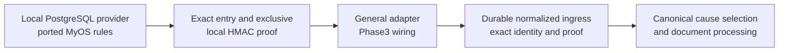

# MyOS Timeline foundation and Coordination adapter

> **Status:** Phase2 local provider/index foundation implemented; general adapter interoperability remains Phase3 · **Semantics:** r15.12 · **Updated:** 2026-09-06  
> [Independent-lineage authority](18-independent-lineage-processing.md) · [Durable integration — 202](202-durable-host-integration.md) · [Validation](11-validation-plan.md)

## Decision

The POC does **not** derive Timeline semantics from the simplified legacy MyOS Mini feeder. The
local `../myos-java` implementation remains the reference for append, clock, predecessor,
idempotency, completeness and transactional rules. Phase2 ported its small row-lock/clock/allocation
mechanics into `blue.myos.mini.durable.PostgresTimelineStore`, with exact typed-value validation and
safe-range hardening. It did not import the whole legacy document runtime.

Phase1 implements canonical selection and authenticated directed root-channel metadata. Phase2
implements local provider/ingress/completeness, indexed membership and successor primitives in
`myos-simple`/PostgreSQL. Phase3 connects their general adapter and proves the real application flow.
The host's 66 tests and the seven actual-library/PG smoke cases passed in the documented scope;
see [readiness](implementation/phase-1-2-readiness.md). They do not claim the full existing MyOS
provider API/wire format or large-graph processing has been integrated.

The consumer is the independent-lineage model in [18](18-independent-lineage-processing.md), not a
single root-wide feeder barrier. Exact Timeline completeness supplies ordered original input;
each lineage additionally needs its relevant causal/source-processing and temporal-membership
frontiers. Agreement can advance independently of old Order reactions where no returning dependency
exists. No provider guarantee proves that an Order's required source consequence has been processed.

This is the implemented foundation plus its remaining integration contract, not a new authorization
to start Phase3. The reference-provider evidence below is kept distinct from local port tests and
from the future runnable graph adapter. The default MyOS application remains on its legacy path.

The configured **trusted Timeline universe** defines supported provider types, exact identity
validation and tenant/environment/domain authorization. It is not an exhaustive bootstrap list of
concrete Timelines, and it is not the completeness cohort for every operation. Creating another
authorized Timeline at the same supported provider does not require restarting the stack.

Coordination derives an exact **operation-relevant Timeline set** from the selected operation's
directed semantic dependencies and the applicable document/occurrence lifecycle state. Order embedding
Agreement ordinarily needs its own Timeline TO and Agreement's TA; Agreement needs TA, not TO merely
because Order observes it. If Agreement itself embeds Order, TO becomes relevant to Agreement too.
Reverse subscribers are delivery recipients, not automatically source-input prerequisites.

The membership identity and its topology/lifecycle basis are immutable for that selection, not for
the lifetime of the domain. Initial admission and relevant topology changes derive a new exact set.
The initial/result subscription-scope proof is an obligation, not the name of a new universal Java
DTO. The implemented `RootChannelMetadata`, receipt-bound reusable component authority and
`DirectedTimelineMembership` validate the selected effective channel surface. The adapter must
associate that closed surface with its configured trusted universe; a genuinely unauthorized/unsupported Timeline
holds before publication with exact evidence and no invented processor status or cleanup. A newly
registered supported Timeline is not such a failure. Missing provider evidence for a relevant member
is a different operational hold; it is never permission to omit the member.

Repository and Contracts remain the semantic authority. The existing `myos-java` document feeder
belongs to an older processing model, so its cross-Timeline tie-break and document runtime are not
copied into the new Coordination integration.



## Provider invariants to reuse

The following reference behavior guided the local port. These source references describe
`myos-java`; they are not a claim that its complete test suite or wire API was reused unchanged:

1. **One provider clock domain.** PostgreSQL supplies non-negative epoch microseconds
   (`PostgresTimelineClockRepository.java:18-27`; `MicrosecondTimestamp.java:3-13`).
2. **Serialized append and guarantee.** Both take the same pessimistic Timeline-row lock
   (`TimelineRepository.java:25-28`; `TimelineGuaranteeService.java:55-96`).
3. **Strict timestamp assignment.** The provider assigns
   `max(dbNowMicros, lastTimestampMicros + 1, guaranteedBeforeMicros)`
   (`TimelineHead.java:32-44`; `TimelineAppendReservation.java:13-29`).
4. **Canonical predecessor chain.** Every non-first entry names the immediately previous exact
   entry BlueId; provider sequence is contiguous relational metadata
   (`TimelineAppendPlanner.java:52-120`).
5. **Sequence-free Blue entry.** Provider sequence supports locking and paging but is not included
   in new canonical Timeline Entry identity (`docs/adr/0026-timeline-authority-envelope-and-sequence-free-entry.md:23-39`).
6. **Exact append idempotency.** Equal intent replays the accepted result; a changed intent under
   the same key conflicts and creates no duplicate side effect
   (`TimelineAppendService.java:100-167`; `TimelineAppendIdempotencyPolicy.java:23-58`).
7. **Exclusive completeness.** A proof for `T` means the accepted prefix with timestamp `< T` is
   complete and every future entry has timestamp `>= T`. The requested boundary is exact and the
   frontier is monotonic (`TimelineGuaranteeService.java:64-96`; `docs/architecture/timelines/guarantees.md:83-145`).
8. **Canonical proof verification.** The proof payload is field-closed and RFC-8785 canonicalized,
   then its signature and persisted row projection are verified
   (`TimelineGuaranteeProofFactory.java:20-112`; `TimelineGuaranteeVerifier.java:20-75`).

All source paths above are relative to `/Users/kamil/Documents/Projects/Blue/myos-java`.

The concrete local proof uses a closed sorted primitive payload and a caller-supplied HMAC key,
binding scope, raw locator, exact typed Timeline BlueId, exclusive boundary and retained prefix.
It is verified against local PostgreSQL authority. Full MyOS proof-envelope interoperability,
production trust distribution and key rotation are not established by that choice.

## Adapter responsibility

The provider proves one Timeline. The Coordination adapter turns that provider evidence into the
portable facts needed for cross-Timeline processing:

```text
verified exact Timeline value and exact Timeline BlueId
verified exact Timeline Entry and exact entry BlueId
predecessor membership and strict timestamp increase
positive epoch timestampMicros in 1..9_007_199_254_740_990, with no rounding; zero is the
before-first sentinel
canonicalOrder = (timestampMicros, exactTimelineEntryBlueId)
verified exclusive completeBeforeMicros frontier, at most 9_007_199_254_740_991
immutable operation-relevant Timeline membership identity and exact topology/lifecycle basis
accepted complete per-member proof/normalized-ingress cohort, with shared indexed authority
external-order policy identity
```

### Concrete identity translation

The host and Core expose different fields intentionally; do not pass one in place of the other:

| Boundary | Identifier and verification |
|---|---|
| `PostgresTimelineStore` rows and host selector membership | Exact typed Timeline BlueId, scoped to tenant/environment/domain |
| `CoordinationCore.TimelineInput.timelineId`, `TimelinePrefix.timelineId`, `EvaluationEvidence.relevantTimelines` | Raw `/timeline/timelineId` locator used by the supported MyOS type; membership comes from the authenticated effective channel surface |
| `TimelineInput.entry` / `event` | The same complete exact typed Timeline Entry; its embedded typed Timeline, actor, timestamp, message, source and exact entry identity are validated together |

The general adapter must translate through the verified exact typed Timeline value. It cannot
use a locator alone as portable authority, pass a Timeline BlueId into Core's locator field, or
attach an unrelated timestamp/event to an exact entry. This does not introduce multi-provider
identity support; aliases sharing a raw locator must not silently substitute another typed value.

The exact entry already contains its exact typed Timeline, so the entry BlueId is a sufficient
identity-only collision tie-break. It must be a canonical plain Base58 SHA-256 BlueId and becomes
the current Language `ExternalOrderKey` text atom. That atom is compared by Unicode code point;
because Base58 is ASCII, this is also unsigned UTF-8 byte order. Decoded digest bytes, Base58
digit-value order, and database collation are not equivalent. Timestamp is the only
priority-bearing field. The tie-break does not grant priority to a provider, channel name, raw
Timeline ID, arrival, or database sequence.

For a candidate at timestamp `t`, the adapter must establish a verified, accepted proof for every
member of its exact relevant set, together with complete local normalized-ingress coverage. Every
proof must establish `completeBeforeMicros > t` before selection. Because the provider guarantee is
exclusive, equality is insufficient: a still-unseen entry at `t` could otherwise change the equal-time
cohort. A member lacking sufficient accepted coverage blocks the whole candidate; it cannot be
omitted from the cohort. A newer stronger proof does not make an accepted older sufficient proof stale.
An unrelated Timeline outside this relevant set cannot block that candidate. Among the complete
relevant equal-time entry cohort at `t`, the least canonical entry-BlueId text is selected first.

Entry ingress and completeness advancement are distinct idempotent operations. A provider may issue
a new guarantee when there is no new entry. First accept the exact proof and normalized contiguous
ingress prefix under that Timeline's scoped authority. Every real provider entry below the accepted
boundary must already have passed exact idempotent Timeline-entry/work ingress. If an entry is
missing locally, that prefix cannot advance; ingest the real entry before retrying. Acceptance of
other independent Timeline prefixes need not roll back or wait for this one.

A relevant-set coverage certificate then binds its immutable membership basis to accepted immutable
prefix authority for every member. Only a complete matching cohort certifies the proposed boundary;
partial coverage cannot select an input. A shared indexed aggregate may reference these accepted
prefixes rather than copying or CAS-checking every volatile member head on every operation. Its
maintained membership and minimum complete boundary must be exact, transactionally coherent and
independently auditable. Cohort construction may be incremental, but certification is all-or-nothing.
“Completeness-only” creates no synthetic entry or document application; it may update coverage and
durable readiness/wake authority. Retry after ACK loss returns the same accepted result.

Scoped compare-and-swap serializes acceptance of a new normalized frontier, not use of every earlier
accepted prefix. Retain exact accepted proof/coverage authority: stronger guarantees and unrelated
above-boundary ingress cannot revoke it or invalidate a prepared consumer solely because the latest
proof/coverage/frontier generation advanced. Do not repeatedly fence a volatile latest pointer when
the consumed immutable prefix is sufficient. Actual current admission reservations, authorization,
relevant topology/membership, supported scope and other semantic controls remain checked; an incomplete or unverified prefix
never gains authority through this monotonicity rule.

### Directed membership, dynamic topology and scope readiness

Membership is not chosen from the rows that happened to load first, or from which handler appears
to read a dependency. Coordination proves the relevant directed subscription surface and its
required earlier lifecycle prefix before declaring a candidate independent. Exact Timeline IDs are
deduplicated for input selection; multiple embedding occurrences still retain their distinct
delivery, observation and gas semantics.

The implemented membership check works from the complete verified forward read cut, with a separate
live-member set: inactive candidate rows cannot simply be deleted from a sealed component's complete
outgoing inventory. Cold root metadata may classify routing without reopening application bodies.
A source's newer physical head cannot select its own earlier input from changed channels or outgoing
topology; absent an authenticated matching logical cut, Core returns a named root-channel logical-view
need. Immutable retained evidence can justify source substitution; ambient current state cannot.

1. Derive the set from the candidate's exact predecessor and required dependency/lifecycle views.
   Follow required embedded-source dependencies; do not traverse reverse-only observers.
2. Acquire complete provider/normalized-ingress coverage for this set and the separately required
   source-processing/lifecycle evidence. Provider completeness does not prove the latter.
3. A relevant dependency may have an earlier topology change introducing another Timeline. Incorporate
   that change and rederive the affected set before selecting the later candidate. If its evidence is
   unavailable, hold that dependent work; do not certify a smaller stale set.
4. A committed local topology change atomically updates the relevant membership basis and its host
   indexes. Invalidate the affected unprocessed backlog selection and reselect from the new surface,
   with the actual activation/history-selection rule. Preserve already committed history; do not
   fabricate an original entry or merge multiple independent historical inputs into one epoch.
5. If the current invocation creates a placement, preserve all synchronous activation, observation
   and queue work owned by that invocation under [21](21-semantic-equivalence-and-source-reuse.md).
   Validate any newly required Timeline and coverage at that boundary; do not unconditionally defer
   this work to commit, nor require the invocation to wait for its own uncommitted result as if it
   were an earlier independent prerequisite. Genuine coupled feedback keeps its whole atomic scope.

For example, Agreement depends on Q and is selecting T10. Q has an earlier T5 operation that embeds
Order. A pre-T5 view of Q cannot prove Agreement independent of Order. Establish Q's required earlier
lifecycle prefix, discover TO, and obtain its required coverage before the T10 selection. This is
a directed dependency check, not a search through every Order that might observe Agreement.

Removal or rebinding produces a new membership basis; it does not erase earlier owed/frozen work.
Accepted proof for the old set remains valid evidence for its original cut, but cannot authorize
selection under the new set. Physical page, aggregate-node and cache generations do not become
semantic member identities or change canonical input order.

The adapter associates the verified MyOS proof, which currently names raw `providerId` and
`timelineId`, with the exact typed Timeline BlueId consumed by Coordination. Raw IDs remain useful
provider locators; they do not become portable source authority on their own.

Admission observes a Coordination-owned scoped reservation and registration/replay handoff, not
another provider priority or synthetic entry. A frozen cutoff `C` separates that admitted lineage's
declared history selection from its continuing live cursor. The overlap proof must prevent missing
or double-applying an original input/source receipt for the occurrence. It does not require the
entire domain's observers to finish or block unrelated Agreement/Order progress through `C`.

Timeline entry/work ingress remains durable before, during and after the handoff. Admission,
source publication, temporal subscription registration and relevant local terminal commits fence
the same overlapping authority. A stale conflicting absence or boundary has zero effect; reprepare
the affected operation under the exact policy. A short host registration lock may serialize that
handoff, but cannot supply semantic ordering or remain a global catch-up barrier.

When Agreement is ahead of an Order's historical attachment/removal, provider completeness and
today's subscriber index are insufficient. Retain source events and combine the occurrence's
temporal lifecycle with consumer progress and a complete membership/registration frontier. Bounded
fanout can remain open while independent operations proceed. Lookup of retained history and live
subscription registration must have a no-gap handoff with concurrent publication; late topology
materialization must also be covered before declaring the recipient set complete.

For direct top-level admission replay, PostgreSQL exposes an indexed canonical-order successor query
over the exact staged relevant Timeline set named by Coordination. The host returns the complete
historical cause that is least after the portable cursor, or phantom-safe proof that this surface is
exhausted through the exclusive cutoff. It may overselect a candidate for Coordination to reject as
inapplicable, but it may not omit an earlier candidate or leak a per-Timeline/page cursor into
portable state. Its coverage cohort binds that relevant set and lifecycle basis, not every Timeline
in the authorized domain. A change to the staged surface requires corresponding selection evidence.

The reference `myos-java` value type permits timestamp `0`, while its old document cursor also uses `0`
as `BEGINNING` and does not advance it (`DocumentTimelineCursor.java:10-22`). The POC reserves zero
for before-first. Let MAX_SAFE = `9_007_199_254_740_991`: entries are accepted only in
`1..MAX_SAFE−1`, while an exclusive completeness boundary may reach MAX_SAFE. This preserves a
representable strictly greater completeness bound for every accepted entry. An entry at MAX_SAFE is rejected
before ingress; it is not accepted into a permanently unready lane. Checked increments and provider
allocation reject entry values beyond MAX_SAFE−1 and completeness values beyond MAX_SAFE, even though
Java/provider signed longs can represent more. Other canonical host timestamp fields retain their
own declared domains; this is a field-specific Timeline rule, not a universal reduction of safe integers.

## Reuse, adapt, and do not copy

| Area | Decision | Reason |
|---|---|---|
| DB microsecond clock and timestamp allocator | ported with zero/overflow hardening | enforces strict provider order and frontier fence |
| append/head/guarantee row locking | ported | prevents forks and append-versus-guarantee races |
| canonical entry factory and predecessor chain | sequence-free typed local construction implemented | matches the Repository shape; physical sequence remains outside identity |
| append idempotency fingerprint and replay behavior | implemented with full intent/guard | identical replay returns the retained result; conflicting intent rejects |
| signed exact completeness proof and verifier | local closed HMAC payload implemented | exact Timeline/scope binding is proved locally; full provider wire compatibility is not claimed |
| Relevant Timeline membership and cross-Timeline proof cohort | library proof and host indexed primitives implemented separately | general adapter translation between verified directed metadata and the host selector remains Phase3 |
| completeness-only host transaction | implemented with normalized-ingress checks | a guarantee can advance without an append and must not create fake input |
| complete-window planning pattern | adapt | Coordination, not the old MyOS document feeder, owns the new eligible-cause policy |
| old document `FEEDER_ORDER` | do not copy | it orders equal timestamps by provider, channel name, and raw Timeline ID |
| `TimelineSortKey` | do not copy | it additionally includes channel, raw Timeline ID, and provider sequence and is not used by production processing |
| old MyOS document processor/fanout | do not copy | it is not the managed-graph/lazy Coordination execution model being proved |
| local HMAC key choice | explicit local POC provider | not a production trust/key-rotation or multi-provider interoperability claim |

The provider append path establishes predecessor continuity, but the old document materializer
checks only Timeline membership, window boundary, and entry BlueId on read. The adapter must verify
page-to-page predecessor/timestamp continuity and must never infer complete coverage from an empty
or partial page.

The incompatible old feeder tuple is defined in
`modules/myos-core/src/main/java/blue/myos/core/documents/processing/domain/DocumentPhysicalInput.java:18-22`.
The unused broader key is in `modules/myos-core/src/main/java/blue/myos/core/common/TimelineSortKey.java:14-40`.
The old tie-break also relies on Java string ordering and a topology-derived minimum channel name;
neither becomes part of the new identity-bound policy.

## Code-sharing decision and remaining interoperability

The implemented choice is a small local port, not extraction of a shared provider module and not
a dependency on the whole `myos-core` runtime. `PostgresTimelineStore` uses the reference clock,
allocation and lock laws with the existing exact Blue validation. Local PostgreSQL tests cover
the corresponding races and boundary conditions. The old feeder comparator is deliberately absent.

This refines the earlier packaging sketch: the local HMAC envelope is sufficient for the explicit
POC provider, but consuming every existing provider API/envelope is not implemented. Phase3 should
reuse this concrete boundary for the first runnable path and document any required wire adaptation;
it must not silently assert full interoperability or start an unrelated multi-provider framework.

## Reference tests and retained verification obligations

| Existing `myos-java` proof | POC use |
|---|---|
| `TimelineConcurrentAppendRaceIT.java:14-67` | retain strict timestamp, predecessor, and no-fork race |
| `TimelineAppendGuaranteeRaceIT.java:13-64` | retain append-versus-exclusive-frontier race |
| `TimelineAppendIdempotencyPersistenceIT.java:35-111` and `TimelineIdempotencyRaceIT.java:13-99` | retain replay/conflict/no-duplicate behavior |
| `TimelineDatabaseFaultIT.java:22-105` | retain rollback and durable recovery fault cuts |
| `DocumentProcessingEqualTimestampFrontierIT.java:27-51` | adapt to noncommutative equal-time entries and assert the new exact-ID order |
| `DocumentInputBacklogOrderingPersistenceIT.java:27-85` | adapt to prove a later relevant input cannot overtake its lineage's canonical predecessor/dependency, without a domain-wide sibling barrier |

The following obligations remain the checklist, not a claim that each row has run at every scale.
Phase2 host tests cover strict numeric/chain/proof/idempotency/cohort and registration primitives;
Phase1 actual tests cover directed metadata and semantic selection. Phase3 must join them through
the general adapter and run the integrated scenarios. Reference test names above are not evidence
of an unchanged `myos-java` suite execution in this POC.

- actual PostgreSQL epoch-microsecond conversion and platform-safe-integer range checks;
- timestamp-zero and entry-at-MAX_SAFE rejection; an entry at MAX_SAFE−1 and completeness at MAX_SAFE
  are accepted and make that last legal entry ready; equality of entry/boundary still blocks;
  checked allocator/completeness increments beyond their distinct maxima reject. Verify exact
  PostgreSQL round-trip and fixture expectations at both endpoints, not just generic safe-integer decoding;
- proof-to-exact-Timeline association and mismatch rejection;
- exact relevant-set identity, canonical member ordering and topology/lifecycle derivation; reject
  missing/extra members and stale selection after a relevant topology change, while ignoring an
  unrelated reverse-only observer's Timeline for source readiness;
- creation/admission of a new same-provider authorized Timeline without stack reset, plus negative
  unauthorized/unsupported exact Timeline identity controls;
- completeness-only prefix acceptance with no synthetic entry/application, idempotent ACK-loss
  replay and scoped proof/normalized-ingress fencing; withhold a prefix when a real entry below the
  proof remains un-ingressed, then admit it and retry. Cohort aggregation cannot certify a missing
  member even when all returned rows and hashes agree;
- complete versus partial/stale relevant cohorts, including a silent/lagging relevant Timeline;
  selection waits for that member, but requires no fresh proof when retained accepted coverage is
  sufficient. In the paired control, a stale reverse-only Order Timeline does not block Agreement;
- stronger proof publication and above-boundary ingress while a cause is prepared: retained accepted
  coverage stays valid and processing makes progress without requiring producer quiescence; real
  reservation/authorization/scope conflicts still reject the stale preparation;
- predecessor continuity across physical page boundaries and empty-page coverage;
- two Timelines with the same microsecond ingressed in reverse physical order;
- scoped admission/history-live handoff with publication-first and registration-first transactions,
  stale reservation-absence preparation and exact deduplication; entry ingress and independent
  source/sibling work continue while genuinely overlapping work waits;
- source-ahead temporal attachment/removal, publication between retained-history lookup and live
  registration, and delayed topology after a scan passed a range; no missing/duplicate delivery,
  no early fanout closure or retention release;
- canonical admission-history successor/end queries across changing relevant-Timeline subsets,
  including equal-microsecond entries, an inapplicable overselected candidate, reverse physical
  pages, and phantom insert/fence conflict;
- dependency Q's earlier topology change introducing a new Timeline before Agreement's later input:
  old Q state cannot certify independence; complete the required earlier prefix and reselect. Add
  removal/rebind, shared Timeline deduplication and current-invocation activation controls without
  losing distinct occurrence deliveries or creating a self-wait;
- Phase 2 page-size, process-restart, worker, and commit-ack-loss invariance for the same normalized
  durable entry/evidence/admission set; and
- a Phase 2 process restart between durable ingress and host read/claim.

Phase 3 scenario M then feeds noncommutative equal-time inputs through real Coordination, including
restart between local commits and reversed independent consumer order, and compares each exact
settled history. Provider completeness alone does not prove this causal selector correct.

## Performance consequence

Provider-assigned time can move ahead of wall clock under rapid appends because it must exceed the
previous timestamp. The reused guarantee service does not promise to certify an arbitrarily future
boundary immediately. Measure assigned-time/guarantee lag and quiet-provider behavior explicitly;
finite processing and eventual valid completeness are liveness assumptions, not permission to guess
that a missing earlier entry does not exist.

Completeness is accepted once for a useful per-Timeline boundary and shared by consumers of that
exact prefix. Relevant-set aggregates combine it without contacting the provider per Handler,
occurrence or Order. Normalize the complete relevant equal-time cohort before local selection;
neither unrelated domain Timelines nor completion of every observer belong to that barrier.

There are two deliberately different scale cases:

| Topology | Agreement's relevant membership and expected cost |
|---|---|
| 100,000 Orders embed Agreement; Agreement has only TA | TA only. A stalled TO must not delay Agreement. Fanout and each Order's own prerequisites are handled independently. |
| Agreement embeds 10,000 Orders with distinct TO values | TA plus every semantically relevant TO and directed nested dependency. Missing required coverage may correctly delay Agreement; that is an authored dependency, not scheduler overhead. |

For the second case, building/changing a large relevant set can require O(number of relevant members)
work, but each subsequent entry must not rescan, copy, decode and verify an unchanged full member
vector. Keep normalized membership and shared per-Timeline prefix authority; use incrementally
maintained minimum-frontier/member-completeness aggregates and indexed successor state, or an
equivalent audited structure. A membership/coverage change updates the affected structure and durable
readiness basis. High-fanout invalidation/wake propagation is itself bounded resumable host work,
not an O(all observers) provider/source transaction. Readers never certify readiness from an aggregate
that omits a relevant membership change or overstates a member's accepted prefix. Conservative lag
may hold affected work until catch-up; it cannot fabricate coverage.

The host now has bounded pages and a persistent indexed k-way successor merge, plus per-member
coverage and bounded reverse wake propagation. Initial construction is O(relevant members);
subsequent calls pop/refill members overtaken by the committed cursor. Its membership definition is
supplied by the trusted adapter: storage fixtures are not proof of the missing semantic translation.

The integrated path must use those primitives to choose the exact next relevant
input. No eager whole-window Java list, full-member rescan per entry, or hidden per-user scan. A
host-private aggregate's shape, partitions and page sizes never select semantic order or enter
operation identity. Different sets may share immutable substructure, but an unproved union of all
domain Timelines is not an acceptable replacement for exact relevant membership.

Measure member count separately from reverse-recipient count, query rows, aggregate maintenance,
provider calls, bytes, lock contention and wake amplification. Exercise both rows above, cold start,
steady-state single-member updates, dynamic add/remove/rebind, lost notification and restart. Required
dependency waits remain visible; the POC must demonstrate bounded host overhead rather than promise
constant total work for arbitrary authored dependency graphs.

## Timeline acceptance obligations (`E2a-T`) and current evidence

The foundation is ready for Phase3 in the [recorded scope](implementation/phase-1-2-readiness.md).
The original obligations below are retained, not waived or all relabeled as integrated passes.
The local provider/index primitives and owning directed-cut tests supply Phase1/2 evidence;
full provider interoperability and the real graph/scale combinations still need Phase3 evidence.
In particular, the 10,000-member metadata probe is not 10,000-source semantic execution, and current
prefix activation fences at most 1,000 dependency sources within a bounded plan. A larger required
activation holds operationally; it must not drop Timelines or be reported as a successful scale run.

- MyOS provider invariants pass through the concrete port/shared boundary; local port results must
  remain distinguished from any unchanged upstream suite or full wire interoperability claim;
- MyOS Mini rejects equal timestamps inside one exact predecessor chain;
- the adapter derives and validates exact Timeline and entry identities;
- exact relevant membership is derived from directed semantic dependency/lifecycle evidence;
  workers reject a mismatched set or stale topology basis, and reverse-only subscribers do not
  enter source completeness;
- newly registered authorized same-provider Timelines work without reset; unsupported/unauthorized
  initial or resulting subscriptions hold distinctly from missing relevant provider evidence;
- membership changes update indexes and invalidate/reselect affected pending backlog without
  rewriting committed history, losing old obligations or creating a self-dependent wait;
- the equal-time cohort uses the bound `(timestampMicros, exactTimelineEntryBlueId)` policy;
- proof-only per-Timeline acceptance creates no synthetic input/application, is idempotent across
  ACK loss and fences complete normalized ingress; exact relevant-set aggregates never certify a
  partial/mismatched cohort or skip a real provider entry;
- missing sufficient accepted coverage for a relevant silent/lagging Timeline blocks the dependent
  candidate; unrelated Timelines do not. Retained sufficient proofs need no needless renewal;
- accepted sufficient completeness/ingress prefixes remain usable under stronger proofs and
  unrelated tail growth, without weakening current reservation, authorization or scope checks;
- the adapter exposes strict exclusive-completeness and exact relevant-cohort evidence without deciding
  ordinary Coordination eligibility; for a typed admission-history demand it returns only the least
  global candidate/end proof for the Coordination-supplied staged surface, while Coordination owns
  final routing applicability;
- Timeline entry/work ingress remains durable during scoped admission, while local publication,
  registration/replay and temporal membership changes fence their exact overlapping authority;
  no gap/duplicate crosses the handoff and no unrelated sibling inherits a global reservation ban;
- source-ahead topology cannot produce a false complete recipient set; source history remains
  retained until required membership/coverage, replay and consumer disposition evidence is complete;
- reverse ingress order, page size, restart, and worker scheduling produce the same normalized
  durable entry/evidence stream and admitted external-work set;
- 100,000 reverse-only observers do not enlarge Agreement's relevant Timeline set, while 10,000
  genuinely embedded dependencies retain complete coverage through indexed incremental aggregates
  and bounded merge/wake work rather than repeated full-set scans.

Integrated scenario M in Phase3 proves that the runnable MyOS adapter supplies these facts to the
real selector and produces the same settled history. No new runtime work is authorized by this update.
