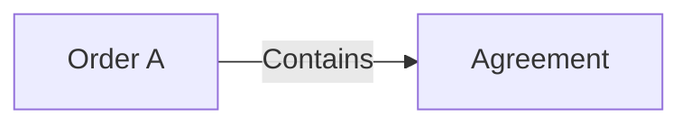

# 2. Is the embedded value another document?

> **Design baseline:** 15.12 · **Status:** logical POC walkthrough; see the [implementation boundary](README.md) for what is verified

[Previous: one Order](01-one-order.md) · [Tutorial map](README.md) · [Next: separate commits](03-one-connected-change.md)

An Order can contain ordinary content, such as a delivery address. It can also contain an Agreement
that is managed as a document in its own right. These are different situations.

## Ordinary inline content

Suppose the Order contains:

```text
deliveryAddress:
  city: Warsaw
```

This address is part of the Order's value. It does not automatically have its own processing history,
independent identity, or session. Changing the city changes the Order.

The storage system might still fetch some exact content only when needed. Lazy loading alone does
not turn that content into a separately managed document.

## A managed Agreement

Now suppose the Order declares that its Agreement is to be processed as an embedded managed document.
The Agreement has its own rules, current state, and history. The Order has a relationship to that
Agreement, rather than owning a second independent copy of its processing history.

The arrow below means **contains a managed occurrence of**, not “runs before”:



MyOS keeps the two document histories and the information describing their relationship. Later,
another Order can refer to the very same Agreement. Each placement inside an Order is called an
**occurrence**. Two placements can point to one document without becoming the same placement.
Each occurrence also records which exact source revision the Order has observed and which receipts
it has consumed. That view is not automatically replaced by the Agreement's newest current state.

## The identity stays; the current value changes

For this MyOS POC, a document's stable identity is the BlueId of its **exact initial authored value**.
That initial value includes its authored state and channels. MyOS does not invent a random ID for
each embedding.

Consider an Agreement whose authored state says `status: draft`:

| Thing being identified | After the Agreement becomes active |
|---|---|
| The continuing Agreement document | same initial authored DocumentId |
| Its current exact value | a different current BlueId |
| An older exact value | still identifiable by its original BlueId |

The continuing history of that document is sometimes called its **lineage**. For this POC, the same
initial authored value selects the same lineage, even when placed in several Orders. Conversely,
two documents that happen to reach the same current value are not necessarily the same lineage:
their initial authored values may differ.

“Same Agreement” therefore means more than “the same visible status”. It means the same exact
authored identity, including the channels and other content that participate in it.

## Initialization is not a cache decision

Keep three states distinct:

| What MyOS has | What it proves |
|---|---|
| Authored Agreement | the requested initial value; initialization may still be required |
| Cached initialization calculation | reusable evidence, not an authoritative document birth |
| Authoritatively initialized Agreement | an accepted initialized state and its established history basis |

For the same logical input and environment, warm and cold execution must preserve initialization
effects, parent observations and semantic gas. Reusing a calculation may save CPU; it must not skip
an initialization event that this embedding must observe, or make the same operation pass a gas
limit only because the cache is warm. The canonical source result and an Order's selected historical
view are different things. [Chapter 14](14-selected-rules.md) gives the selected startup rule.

Source computation, each Order's reactions, and physical reconstruction are separate measurements.
Canonical source initialization and each Order's consumption have separate fixed gas budgets, even
when both run on a cold host. Source gas settles once when that canonical result gains authority;
rebuilding cached content cannot charge it again.

Agreement has canonical initialization and FULL_HISTORY. An E15 belongs to that history whether the
first Order appears at T10 or T20. `FROM_NOW@T20` means that this **Order** does not replay E15 as its
historical event; it does not erase E15 from Agreement. Its installed initial view is the exact
Agreement view at the declared attachment boundary. FULL_HISTORY observes the selected earlier
history. The first database insert never chooses Agreement's history. A failed creator publishes no
orphan new source, while an already authoritative Agreement survives another Order's failure.

## What this does not imply

The ordinary managed case does use independent commits: Agreement commits its source result, then
each Order consumes it through its own complete operation. Sharing does not force one all-parent
transaction. Ordinary inline content remains part of its owner's local atomic operation. Shared
writes remain restricted by Contracts. A real returning dependency places its strongly connected
documents inside one atomic workflow; one-way observers stay independent. The next chapter follows
the normal independent case.

**Check your understanding:** if 1,000 Orders embed the same authored Agreement, does MyOS allocate
1,000 Agreement IDs? No. There is one Agreement lineage and 1,000 placements referring to it.
