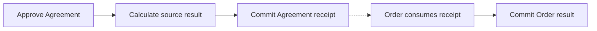

# 3. One Agreement change, two complete commits

> **Design baseline:** 15.12 · **Status:** logical POC walkthrough; see the [implementation boundary](README.md) for what is verified

[Previous: document or content?](02-document-or-content.md) · [Tutorial map](README.md) · [Next: many Orders](04-one-agreement-many-orders.md)

Order A already embeds a separately managed Agreement. Its rules read that Agreement and change
only Order A. This is the ordinary managed-embedding case, including normal live processing:

- An approval request changes Agreement from draft to active.
- Agreement emits an “Agreement activated” event.
- Order A consumes that committed change and sets `canProceed=true`.

The source and consumer have separate histories and **separate complete commits**. Managed embedding
does not make every connected document one atomic operation.

## Follow the processing

1. Coordination selects the Agreement's allowed input and exact state.
2. Contracts calculates Agreement's complete local result, including its event.
3. MyOS commits Agreement's new state and history, sufficient exact observation evidence, and durable
   authority from which required consumer work can be discovered. A crash cannot lose that obligation.
4. When Order A is eligible, Coordination selects the exact next source receipt for its occurrence.
   Its rules observe the source's required changes in their defined order. A receipt's final revision
   is not automatically the correct state for every intermediate observation.
5. MyOS commits Order A's complete local result, its consumed-receipt cursor, and any new outgoing
   obligations together. It does not run Agreement's original approval rule again.

Arrows here mean **causal processing steps**. Each commit is complete; the gap between them can be short.

## What can be durable at each point?

| Point | Agreement | Order A |
|---|---|---|
| Before approval | draft | `canProceed=false`, old observed revision |
| Source commit completed | active, receipt retained | still old, with discoverable work outstanding |
| Consumer commit completed | same committed source transition | `canProceed=true`, import cursor advanced |

The middle row is a valid durable state, not a partly saved Contracts invocation. Order A is waiting
to perform its own invocation. A crash there resumes its missing reaction without recomputing the
already committed source transition.

Do not confuse durable discovery with a guessed recipient list. If Agreement is ahead of some
Orders' historical topology, “the parents visible right now” may omit a relationship that applies
at the receipt's semantic position. Receipts and historical occurrence selection preserve the work;
closing delivery requires the semantic-frontier evidence defined in
[the processing contract](../18-independent-lineage-processing.md).

## What if the Order fails?

If Order A exhausts its invocation gas or returns another deterministic failure, that invocation
has its specified failure and rollback. Agreement stays active. A different Order that already
reacted also keeps its result. Failure handling must preserve the exact diagnosis and outstanding
delivery/completion state; it cannot claim that every required reaction succeeded.

Source execution, consumer work and receipt verification are measured separately. Physical reuse
does not justify deleting semantic charges or granting a fresh gas budget halfway through one
atomic workflow. The selected ownership mapping must be implemented and verified in the libraries,
not chosen by the cache.

## A complete result must preserve every required observation

Suppose Agreement changes its counter twice inside one operation. A parent Document Update handler
may observe both values before the operation ends. A different event-only example may legitimately
observe the final value twice. The original Contracts processing rules decide which is correct;
“one receipt means one visible after-state” does not.

Revision 15.7 withdraws that earlier final-state-only rule. The retained result must carry enough
semantic observation evidence to reproduce the required reads, updates and event admission order.
[Chapter 13](13-equivalence-and-reuse.md) gives three tiny examples; none needs feedback or shared writes.

## Two placements advance as one defined operation

Suppose `/left` and `/right` both contain Agreement0, which changes to1. Coordination updates the
placements in canonical path order. It updates `/left` and finishes its synchronous update handlers
before updating `/right`. Therefore a `/left` update handler reads `/right/counter=0`; a later event
after both updates reads1. Updating all references first would change that answer.

Before updating a later placement, check that the original occurrence still exists. A handler that
removed or replaced `/right` does not authorize writing into its replacement. Already frozen event
deliveries keep their specific validity rules. Database pages cannot change this order, split the
operation's gas/rollback, or discard required deliveries.

If a handler creates a third placement, its initialization and selected initial view are available
before a permitted creator read. Historical source epochs are different: they enter an ordered
attachment lane and run as later operations. The creator sees the installed initial value and its
current parent fields, not fields that only historical reactions will set later. It does not wait
for its own commit or replay the old placements because the new one appeared.

There is one important distinction when writing a Sequential Workflow. Its steps first calculate
the handler's result; then Coordination applies that result. A step can preview changes made by an
earlier step, but this preview does not run child initialization or other document reactions.
For example: step 1 asks to embed Agreement, step 2 reads its authored value, the handler returns,
Coordination installs and initializes Agreement, and the next handler reads the initialized value.
“Initialization before the next read” means a read after that actual installation boundary, not a
preview while the creating handler is still calculating its result.

## Where does atomicity still apply?

Every local invocation is all-or-nothing: document changes, internal work/events, gas result, consumed
receipt, and outgoing obligations cannot be published in fragments. Ordinary inline content belongs
inside that owner's operation. Any explicitly synchronous operation has its own reviewed atomic
boundary; sharing a managed reference alone does not create one.

A reaction that writes a shared source, crosses into another writable lineage, or creates cyclic
feedback is not the simple read-source/write-local case. Its causal and invocation boundary needs
the explicit rule in chapter 9, not an automatic “all connected documents commit together” fallback.

The baseline Contracts/Coordination could process active containing parents inside the source closure.
Phase1 changes that managed boundary in the owning libraries. It is
not a PostgreSQL-only optimization. Its ownership/rollback mapping must be explicit, while ordinary
Contracts remains the source of required observations and atomic workflow order. Defining a new
eager interpreter that agrees with a new lazy interpreter is not sufficient evidence of equivalence.
See [the selected processing kernel](../22-processing-kernel.md).

**Check your understanding:** may Agreement be committed while Order A still waits? Yes. Its exact
reaction must remain recoverable and occur in the right history; the source is not rolled back.
