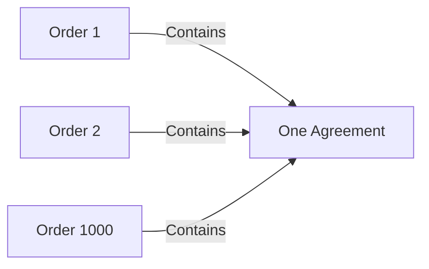

# 4. One Agreement, 1,000 independently progressing Orders

> **Design baseline:** 15.12 · **Status:** logical POC walkthrough; see the [implementation boundary](README.md) for what is verified

[Previous: separate commits](03-one-connected-change.md) · [Tutorial map](README.md) · [Next: lazy reads](05-read-only-what-is-needed.md)

Now 1,000 Orders use the same Agreement. Each Order reads an observed Agreement revision and writes
its own local state. There is one authored Agreement lineage, not 1,000 copies of its processing.

Arrows in this picture mean **contains a managed occurrence**. They do not form one transaction.



## The useful saving

Agreement computes and commits one source transition with sufficient retained observation evidence. The Orders consume
that exact evidence and run their own reactions. Independent Orders may run in parallel and finish
at different wall-clock times. There is no required 1,000-parent commit or fan-out barrier before
Agreement becomes authoritative.

```text
Agreement committed source transition:   1
Agreement calculation during imports:    0 reruns
Order reactions:                        up to 1,000, each with its local result
```

Order 1 might become ready to ship while Order 2 still needs payment. Both must run their own rules.
Deduplicating their reactions because they use the same Agreement would discard real behavior.
One failed or offline Order does not undo Agreement or prevent another independent Order's progress.

The source commit retains durable delivery-discovery authority, not merely a transient notification.
It does not have to create 1,000 jobs in that transaction. MyOS owns finding and processing every due
reaction, or recording its specified terminal failure. Coordination supplies the rules that say
which reactions are due, their order, required views and gas; MyOS chooses indexes, queues and workers.

## How MyOS finds the work

MyOS maintains a database index answering: **which Order occurrences observe this Agreement at the
relevant logical position?** Creating, removing or changing an embedding updates that index in the
same transaction as the document change and the durable basis for resulting work. The index includes
the necessary activation/retirement and progress information; it is not a cache repaired by replaying
all histories before every lookup.

1. Agreement commits its result and a durable pointer saying that delivery work remains.
2. MyOS reads the next bounded recipient page through the index and records due work plus page progress.
3. Workers take ready candidates from a ready-work index; Coordination checks their exact eligibility.
4. If an Order needs Agreement through T, it waits. When that prefix is available, a reverse dependency
   index finds the affected waiting work rather than polling every Order.
5. Each Order atomically saves its outcome, permitted progress and any new work. A crash resumes from
   those records without forgetting recipients or repeating a committed reaction.

If an earlier attachment/removal has not been processed yet, its incomplete progress is explicit.
An index of only the links visible today would not be enough. Correct temporal indexes let MyOS
answer efficiently without scanning all documents or reconstructing their histories.

## The source can be ahead without the Order reading the future

Suppose Agreement committed `count=1` at T10 and `count=2` at T20. A slow Order still has an original
T15 request that records Agreement's count. It must record **1**, even when the latest source row is 2.

Its occurrence pins the observed revision and receipt cursor. Coordination processes the due import,
the Order's T15 request, and its later import in their correct semantic order. A fast Order may already
have consumed T20. That difference is processing progress, not different business history.

Waiting does not create a new attachment. An Order that was connected at T1 remains connected at T1,
even if it resumes next week. Chapters 7 and 8 distinguish this from an actual new T10 relationship.

## “Once” still needs a careful measurement

Agreement's uncommitted source attempt may repeat after a crash or missing content. Once its source
receipt commits, retrying Order 37 must not rerun that source computation. Physical source attempts,
logical source transitions, receipt verification and required consumer processing are separate costs.
The source evidence may need intermediate observations and event-admission boundaries, not only a
final snapshot. Reusing it still avoids rerunning the source rules; replaying required observations
and running the Orders' own rules is real work, not wasted duplication.
The same distinction applies at startup: one canonical source initialization, each Order's import
and reaction, and any physical reconstruction are measured separately. Warm versus cold storage or
reversing physical worker order must not change semantic gas for the same logical initialization.
Source initialization has its own fixed budget; each Order has its own consumption budget, cold or
warm. Source gas settles once when its canonical result gains authority. Cache reuse cannot delete
an Order's required import/reaction charges or settle the same source initialization again.

Compare 1, 10, 100, 1,000, 10,000 and 100,000 Orders with matched failure schedules. Measure whether consumer count
increases source execution calls, whether a consumer crash retries only its own unfinished local work, and
whether discovery or repeated evidence copying hides avoidable whole-graph work.

The source commit is not the end of all reactions. Report its latency separately from consumer
throughput and lag. Agreement should commit promptly relative to its own work; it does not wait for
100,000 Orders. Those 100,000 real reactions may take longer, and their required logical processing
has a cost. There is no promise that every fanout size finishes in seconds.

The platform must keep memory, transaction sizes and concurrent work bounded. Large fanout becomes
controlled backlog; fair scheduling prevents it from monopolizing other users' documents. Millions
of unrelated documents must not turn one Agreement change into a global scan. Tests include thousands
of active documents for one user, not only an otherwise empty database.

A dashboard or test may additionally ask whether all required reactions are accounted for. That is
optional reporting, not a global commit, extra gas charge or barrier for Agreement. If reported,
it needs complete recipient coverage and all outcomes: an empty queue is not enough, and a failed or
missing Order cannot count as successful completion. Seconds-scale completion remains a measured
target for small healthy groups, not a universal fanout deadline.

This simple independence assumes read-only source access and local writes. Shared writes and cycles
need an explicit reviewed causal boundary; parallel worker completion is never a semantic comparator.

**Check your understanding:** can Agreement commit once while 1,000 Orders catch up separately? Yes.
The gain is reusable source processing, with every Order's exact history still required.
