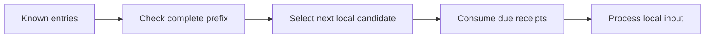

# 6. Why an available event may still have to wait

> **Design baseline:** 15.12 · **Status:** logical POC walkthrough; see the [implementation boundary](README.md) for what is verified

[Previous: lazy reads](05-read-only-what-is-needed.md) · [Tutorial map](README.md) · [Next: joining history](07-joining-an-existing-history.md)

Consider two requests:

```text
Earlier: activate Agreement
Later:   let Order read Agreement status
```

Reversing them can change the Order's result. The worker that happens to wake up first cannot choose
the business order.

## Semantic time and wall-clock time

**Semantic time** comes from accepted Timeline entries and their canonical order. **Wall-clock time**
is when a machine receives, loads, or processes them.

The later request might arrive at MyOS first. The earlier request might be temporarily unavailable.
Correct processing must still respect the semantic order. Running the later request immediately
and hoping the final state eventually looks similar is not enough: histories and observations matter.

The proposed order uses microsecond timestamps. Within one Timeline, timestamps strictly increase.
If entries from different Timelines have the same timestamp, their exact entry BlueIds provide
a deterministic tie-break. Provider name, queue position, worker
ID, and arrival time do not provide priority.

A Timeline entry and an internal event are different. Two separate inputs that successfully change
Source to 1 and then 2 produce their respective source operations; Parent and Root must observe their
corresponding historical views 1 and 2, not whatever later head is cached. In contrast, one input can
queue several internal events inside one operation. Those events follow Contracts FIFO and do not
each create a separate epoch. A newly emitted F1 joins behind an already queued E2; its immutable
payload can contain 1 while a later document read sees 2. [Chapter 13](13-equivalence-and-reuse.md)
walks through both cases without confusing their operation boundaries.

## How can we know an earlier entry is not still coming?

A Timeline provider can issue a completeness statement. In plain language:

> All entries before this boundary are known; no new earlier entry will appear later.

For a candidate timestamp, the required providers must establish completeness **strictly beyond**
that timestamp. A boundary equal to the timestamp does not exclude another entry at that same time.
MyOS must also have imported the actual earlier entries. A provider's promise does not substitute
for an entry that has not reached the local database.

This diagram shows **selection for one consumer's next historical position**, not a global barrier:



## A concrete pause: the child has not caught up to T

Suppose an Order request at T=20 needs its Agreement state. MyOS has processed the Agreement only
through time 10. An activation at time 15 is already stored, but its processing has not finished.

1. Keep the Order request waiting; do not calculate its answer from the old Agreement state.
2. Establish the required complete input prefix and commit Agreement's earlier activation with its
   source receipt and durable delivery-discovery authority. Other Orders need not finish first.
3. Complete this Order's imports required at this point under its occurrence's history selection.
4. Read the correct Agreement state and let the Order request proceed.

The activation might still be missing from storage because its provider is unavailable. Then the
wait continues until the evidence arrives. Neither case means saving half of the Order's invocation.

“Caught up to T” does **not** mean inventing an Agreement revision at every timestamp. It means the
required earlier input and consequences are accounted for, with evidence that no earlier input is
missing. The Agreement might need no new change at all. We must also respect the exact tie-break
when another entry has the same timestamp as the Order request.

## A quiet Timeline still matters

The relevant Timelines follow directed dependencies: the documents this document embeds, not every
document that embeds it. A quiet relevant member must still supply completeness evidence. Silence
cannot prove that no earlier entry exists; a guarantee needs no invented business event.

For Order with Timeline TO embedding Agreement with TA, Order needs their relevant prefixes.
Agreement does not need TO merely because Order observes it. A broken Order provider cannot stop
Agreement. Conversely, an aggregate embedding10000 Orders really does depend on their relevant
prefixes. MyOS maintains shared membership/frontier indexes and merges changes incrementally; it
must neither omit a quiet member nor scan all10000 on every next entry.

Once an input is selected, Coordination also accounts for work it causes. A later unrelated input
must not overtake the required earlier consequences in a dependent lineage. This does not impose a
global fan-out barrier: independent Orders can progress, and Agreement can advance while a slow
Order retains an older observed revision.

For example, Agreement has committed count 1 at T10 and count 2 at T20. An Order's original T15 read
must still see 1. Its due receipt prefix and complete earlier inputs authorize that observation;
the source's latest head and worker completion order do not. Source processing need not wait for
every Order to perform T15, but no Order may jump over T15 and then reconstruct it using count 2.

Source-ahead progress also requires historically correct relationship indexes. MyOS must maintain
them consistently with committed activation/retirement history, so an indexed query identifies due
recipients without scanning or replaying all document histories. A current-links-only index cannot
substitute for the relationship at the receipt's logical position, and an unprocessed earlier
attachment/removal remains a readiness dependency. Durable indexed discovery and a proved semantic
frontier close that gap; the exact rule is in
[the processing contract](../18-independent-lineage-processing.md).
Returning dependencies use the selected shared workflow scope, as chapter9 explains.

We want small connected groups to finish in seconds on the healthy path. A large independent fan-out
has a different target: prompt Agreement commit plus bounded, fair, scalable Order processing. Its
total completion time may grow with the number of required reactions. With millions of documents,
work selection must use maintained indexes rather than scanning all documents or every active
document of a user. Measure throughput, lag and stability as well as latency; never drop ordering
evidence to make the numbers smaller.

**Check your understanding:** does “the queue is empty” prove a Timeline is complete? No. It only
describes what this queue currently contains.
