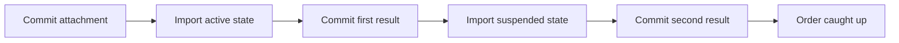

# 7. An Order joins an Agreement that already has history

> **Design baseline:** 15.12 · **Status:** logical POC walkthrough; see the [implementation boundary](README.md) for what is verified

[Previous: time and order](06-time-and-order.md) · [Tutorial map](README.md) · [Next: starting from the beginning](08-starting-from-the-beginning.md)

So far, the Order was already connected when the Agreement changed. Now the Agreement has been
processed before this Order attaches to it. Its stored history contains:

```text
initial value: draft
first change:  active
second change: suspended
```

At an accepted attachment point T, the Order adds an embedded occurrence referring to an older
Agreement value. This example uses historical import: the Order must observe the required intervening
changes, not silently jump to the latest value.

This is an actual new relationship. An Order that was already attached and merely fell behind uses
the same receipt-consumption mechanism, but keeps its original activation and history selection.
Waiting a week does not move that relationship's semantic attachment time to next week.

## What gets reused?

The Agreement's source changes have already happened. Their stored records must identify enough
exact observations, updates and event ordering to reproduce the required history. Before/after values
and a flat event list are not sufficient for every case; chapter 13 shows why. Coordination validates
the selected records and their meaning.
It does not run the Agreement's original activation rule again for each new Order.

A required historical step can even have no visible value change and no emitted event. It still
needs verified evidence of the actual completed source application. MyOS must not invent such a
step from an unexplained pair of equal values, or silently discard it just because it looks empty.

This is not just loading missing content as in chapter 5. Loading supplies data for an attempt;
catch-up applies previously unobserved source history to the Order, runs its required reactions,
and records completed processing steps.

For this simple example there is no feedback into the Agreement. The historical portion needed
through attachment point T is finite and does not grow because an unrelated later request arrives.

## Walk through the catch-up

For an attachment whose reference semantics allows subsequent historical processing:

1. Commit the accepted attachment and record the history the Order still needs.
2. Import the first required Agreement change. Run the Order reactions required by that import.
   Commit this complete processing result and the fact that the first step is done.
3. Import the second change, run its required reactions, and commit that complete result.
4. Verify that the required history and all consequences are finished. The Order can now continue
   with later work that depends on the caught-up state.

Arrows below mean **successive completed processing steps**:



| Durable progress | Order's imported Agreement state | Remaining work |
|---|---|---|
| After attachment | selected older state | first and second imports |
| After first import | active | second import |
| After second import | suspended | none in this simple example |

Each permitted commit saves one complete logical operation, its exact progress and outgoing work.
It is not an arbitrary batch of events picked by database page size. Per-placement cursors preserve
which deliveries each placement has handled; the exact grouping, gas and rollback must follow the
reference operation. A receipt boundary alone does not prove a new invocation boundary.

Initialization and the selected initial view are available synchronously to a permitted attachment
handler read. Historical source epochs run through the later ordered attachment lane; the creator
does not already see parent fields that those later reactions will set. FROM_NOW installs its exact
boundary view; authored-from-origin FULL_HISTORY starts at initialization. Missing the required
initial view waits before the attachment finishes, while missing later history waits in that lane.
Storage retries never invent history or make old placements consume a delivery twice.

If MyOS restarts after the first import, it retains that result and continues from the next required
step. It does not start the Order's history again or apply the first import twice.

## Do not lose the change that arrives while the Order joins

Registration briefly records a source position h together with the continuing relationship. Selected
old history comes from the retained part through h; new arrivals come from the tail after h. That
short protected handoff prevents an append from falling between “finished looking backward” and
“started watching forward”. It does not lock the source while the Order processes its history.
Position h is a storage boundary, not permission to consume a change before its logical time.

Source history being available and all relevant relationships being discovered are separate facts.
Even an admitted Order whose earlier attachment has not yet been reconstructed must be accounted
for before declaring delivery complete. Agreement can commit meanwhile; it need not wait for every
Order to finish backfill or for a 1,000-parent transaction.
MyOS owns reliable delivery discovery and scheduling, using relationship/history and work indexes
kept consistent with committed changes. This is not a request to replay all relationship histories
for every receipt. Bounded indexed batches find recipients and ready work; pending earlier topology
work must still be represented so an incomplete prefix is not mistaken for a complete one. Global
completion reporting is optional host/test functionality, not another document operation or a
barrier delaying Agreement's commit.

## What if only the second import's content is unavailable?

Suppose the first import has finished calculating, and verified stored facts already identify the second import
and prove it is next. Its event body is temporarily unavailable. MyOS can save the complete first
result together with the exact next-step reference. The second step then waits for its content;
the Order is not yet caught up. After recovery, MyOS verifies the supplied content and runs the
second step, without repeating the committed first step.

This works only when the missing bytes are needed solely for the next step. If they are needed to
validate the first result or decide what comes next, processing must still wait before committing.

A dependent later input cannot use this Order at the wrong historical point. Independent Orders
can still progress while this one waits. A new change actually caused by catch-up is different from
an unrelated future input; chapter 9 covers that case.

## What if an import deterministically exceeds gas?

Unlike missing bytes, terminal gas failure is a completed disposition of that delivery. The selected
proposal keeps Order's real rollback state, epoch and successful imported view unchanged, records
the failure and proceeds to the next due delivery. Coordination must validate the source's original
continuous history and intervening dispositions rather than invent a successful import.
This rule covers `GAS_LIMIT_EXCEEDED` and recognized deterministic semantic `RUNTIME_FATAL`, not
every processor error. Missing data, timeouts, cancellation and unknown exceptions do not consume
the delivery. Other statuses retain their own operation-kind disposition.

For example, Order still sees0 after failed r1:0→1. Source r2 is1→2. The next r2 operation first
aligns Order's reference0→1 through a normal containing update, then replays r2's own1→2 work.
Both phases share one budget and rollback. An event before r2's first update reads1; original r1
events are not replayed, although alignment can cause new update reactions. Alignment can itself
exceed gas and leave Order at0 again. This does not combine ordinary successful steps or split a cycle.

The first failed step does not abandon the rest of an import page/range. Continue in canonical
order, recording each outcome. A fixed attachment lane can finish with failures; later successful
steps may have their normal business effects. An intervening earlier local input runs when due,
not after every receipt that happens to be stored already. For a read before r2, the actual pin is0.

A later detach can run when canonically due after earlier deliveries are accounted for; it cannot
skip an earlier nonterminal wait. Phase1 implements this owning-library extension; the general
durable adapter remains Phase3 work. [Chapter 10](10-crashes-and-resume.md) explains the
separate failure and successful-view records.

For example, attachment K100 imports an old source event E10 and its handler emits a new event F.
The original event still has E10 provenance. Finishing the new import and its required consequences
belongs to K100, however; it must not reopen the already closed original E10 computation. “Where
the event came from” and “which accepted work must finish this new reaction” are different questions.

Finally, importing an old event after attachment does not mean this Order existed when the source
originally emitted it. This is **late attachment semantics**. Reconstructing an Order from the
beginning of its own history is a different problem, explained next.

**Check your understanding:** after the first import commits, does a failure in the second erase it?
No. Only the failing invocation rolls back; earlier committed history remains.
