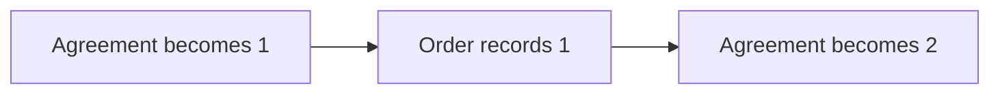

# 8. Starting an Order from the beginning of its history

> **Design baseline:** 15.12 · **Status:** logical POC walkthrough; see the [implementation boundary](README.md) for what is verified

[Previous: joining history](07-joining-an-existing-history.md) · [Tutorial map](README.md) · [Next: cycles and feedback](09-cycles-and-feedback.md)

This chapter explains the chronological FULL_HISTORY rule implemented in the library boundary.
Library tests and selected real-database bridges cover its core behavior; connecting general
admission and all these variants to the MyOS application remains Phase3 work. This walkthrough
is not a blanket claim that every case has passed end to end.

## A tiny example that reveals the problem

An Order's initial authored document already embeds an Agreement. The Agreement starts with
`count=0`. The Order has a rule that copies the Agreement's count when asked to record it.

The timestamps below are shortened labels on one common microsecond scale, not wall-clock delays:

| Semantic time | Input |
|---|---|
| 10 | Agreement count becomes 1 |
| 20 | Order records the Agreement count |
| 30 | Agreement count becomes 2 |

MyOS begins reconstructing the Order only after all three inputs are available. What should the
Order record?

**The intended answer is 1.** At the Order's semantic time 20, the Agreement's time-30 change had
not happened yet. The fact that a database already contains the Agreement's later state must not
make the earlier Order observation read the future.

Arrows here mean **the observation order that reconstruction must preserve**:

The final Agreement count is 2, but the Order's recorded observation remains 1. Comparing only the
Agreement's final value would miss the bug.

There are two observations to keep apart. The Order might read the Agreement itself through
`/child/counter`, or read its own `/counterB`, copied earlier by an event handler. A correct copied
value does not prove the first read resolved the right historical document. The planned checks
must exercise both, including a child change that emits no matching event to update the copy.
The expected values are checked separately; without that event, the copy may correctly differ from
the child's own value.

They must also account for every original Order input, in order and with the correct number of
applications. Two requests may correctly record the same value, but both processing records must
exist: equal values cannot hide a lost request or a duplicate assignment. Historical imports and
original Order inputs are different steps; one cannot stand in for the other just because their
final values match.

## Why “catch up every child first” is wrong here

That shortcut would bring the embedded Agreement all the way to 2, then replay the Order's earlier
record request. The Order would record 2. Every individual read might be valid current database
content, yet the combined history would be wrong.

Coordination therefore needs to combine the relevant history in the correct logical order. Stored
source history can supply the Agreement state and events needed at a historical point. This is not
permission to roll the authoritative Agreement backward or rerun all of its business processing for
each Order.

This is the same source-receipt consumption principle used for an already connected but delayed
Order. Agreement may have independently committed both changes before this Order runs. The Order's
observed revision and cursor keep its time-20 read at 1. Physical delay alone neither creates a new
attachment nor turns the source and every consumer into one atomic operation.

## What if the Order changes the relationship halfway through history?

Suppose Agreement B has changes at 10 and 30 already stored. The Order A has imported B@10. Its
own time-20 request now removes that Agreement, or switches the same path to Agreement C.

The intended first version must support these ordinary operations within its supported scope.
It must not silently become a read-only history viewer. Nor may it import B@30 before processing
the time-20 request simply to make B's catch-up look complete.

After a successful removal, earlier imports remain in A's history, but B@30 must not arrive through
the removed relationship. B's own history and other Orders are unaffected. When switching to C,
the same property path does not mean the same relationship: C needs its own exact binding and
history selection at time 20. Old queued B work cannot become C work or recreate the removed B.
All of this belongs to the complete successful processing result; a failed request cannot publish
half of the relationship change.
Effects already accepted inside that invocation still follow their original routing rules. For
example, E1 removing a placement is not a blanket instruction to drop E2 from that same frozen
imported batch. Retiring the relationship prevents obsolete later imports, not completion of valid
current work; the actual handler and delivery rules still apply.

Keeping an old value available for a read is not the same capability as changing a still-pending
relationship. Phase1 repairs the baseline restriction on this change. When Order removes a
relationship, it retains the exact view selected at that removal point—not automatically Agreement's
newest state or Order's original pin. Only that old relationship's future work is retired. A later
replacement gets its own history selection; changing the path's occupant does not inherit the old
occupant's progress. These facts must survive database storage and restart in Phase3 too.

## How this differs from late attachment

In chapter 7, the Order adds a relationship at a new attachment point and imports the required older
history according to that operation. Here, the relationship is part of the Order's initial authored
graph and FULL_HISTORY reconstructs its historical observations. Those inputs are different. We
must not silently implement one behavior under the other name.

Take two documents A and B. B emits `CounterChanged(5)` at time 5; A has a handler that copies the
event's value into `counterB`:

| What actually happened | Correct A history |
|---|---|
| A attaches B at time 10 and imports B's older event | Counter unset before 10; becomes 5 during the attachment's catch-up |
| A attaches B at time 1, before B changes | Counter becomes 5 in response to B's event at time 5 |

Both end with 5. Their histories are correctly different. In the first case, the imported event
still comes from time 5, but A's reaction does not get inserted backward into A's time-5 history.
Time 10 identifies the attachment's causal position: it does not retimestamp the old event or mean
that all catch-up must commit in one invocation. Loading B's value without the required event/update
and matching rule is not an implicit assignment to A's counter.

Also distinguish attachment time from the time MyOS starts reconstruction. If the authored history
says A attached at time 1, starting its reconstruction after time 10 must still reproduce the second
history. A slow worker cannot move the attachment to a different point in semantic history.

## An old event does not make a new relationship old

Consider a different Order that attaches to Agreement at time 100, then imports an Agreement event
originally recorded at time 10. Its new processing record can remember that old event time. That is
where the event came from, not proof that the Order's new relationship existed at time 10.

Reconstructing history only through time 50 must not include the effect of that time-100 attachment.
MyOS therefore keeps both the original event's identity and the completed processing step that
produced each new revision. Two distinct imports may even have the same original event time.
Sorting those records by the remembered event time alone would give the wrong history; inventing
new timestamps would not repair it. Phase 1 tests must prove the exact selected history.

The reverse mistake is also possible. C changes to 1 at time 10. B initially embeds C and its handler
records that value, but MyOS reconstructs B only under cutoff 40. A initially embeds the same B;
its time-20 request records B's value, and A is reconstructed under cutoff 60. A must record 1.
B's later reconstruction must not make its reconstructed time-10 history invisible to A at time 20.

These two controls belong together: a genuinely new time-100 attachment is absent at time 50, but
physically late reconstruction does not erase an initially embedded document's earlier history.
The implementation must prove the exact histories, not choose by the remembered source timestamp
or admission cutoff alone. This is not permission to move new effects in an already processed source
back before its existing history; feedback needs its own explicit trace.

## What remains to prove

The three-input example is the first test, not a complete algorithm. A harder case is one original
external input that addresses both Agreement and Order. Merely sorting two imported items by
timestamp does not establish the right reaction order, invocation grouping, gas, or rollback.
The reviewed rule must derive observations and atomic workflow order from the actual Contracts
reference, then explicitly establish the ownership/commit mapping for managed sharing.
[Document22](../22-processing-kernel.md) fixes the selected mapping. We cannot make an
incorrect importer its own reference by writing an eager version of the same shortcut.

Same-cause inputs and inherited source reactions use the kernel's causal origin and complete owned
scope. Multiple placements update sequentially; new placements initialize synchronously while their
historical epochs run in an ordered later lane. Observation-program boundaries preserve source-local
intermediate changes and parent reactions instead of all-after-views-first or flat receipt replay.
A later Agreement result still cannot precede the Order's earlier observation, even when it is
already stored. Original input boundaries must not be merged, split or charged fresh gas merely to
fit a receipt representation.

Phase1 implements the multi-source, visibility and relationship-change rules with actual Coordination
and Contracts tests. The current database bridges cover selected boundaries; Phase3 must verify
the general MyOS integration and its storage/recovery behavior against the same semantics.
Neither stage may quietly substitute “read the latest source”, omit original inputs, narrow the
intended scope to reads only, or change invocation boundaries to make a test pass. This tutorial
is not an executed coverage report or authorization for additional runtime work.

**Check your understanding:** can an old Order request read a later Agreement state just because
the later value is already stored? Not in chronological FULL_HISTORY reconstruction.
