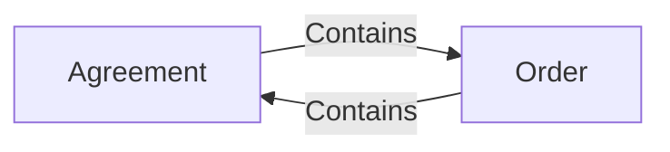

# 9. What if a reaction changes the source again?

> **Design baseline:** 15.12 · **Status:** logical POC walkthrough; see the [implementation boundary](README.md) for what is verified

[Previous: historical reconstruction](08-starting-from-the-beginning.md) · [Tutorial map](README.md) · [Next: crashes](10-crashes-and-resume.md)

A graph can contain a cycle. For example, an Agreement refers to an Order, and that Order refers
back to the Agreement. Neither relationship means “always execute this document first”.

These arrows mean **managed containment relationships**:

The processing engine determines the reactions required by the exact input and the graph at the
relevant moment. It cannot use “I have seen this document before” to discard every later visit:
a later visit may be a new, legitimate event.
The selected boundary is the strongly connected component: documents connected by paths that return
to their starting point. Agreement and Order in this diagram share one workflow, gas and rollback.
One-way observing Orders outside it remain independent. A new return path requires the gas-admission
check below before it can join tentative work. Once joined, a later detach cannot undo work already
charged or shrink its rollback ownership. Moving each hop to a fresh-budget commit would change this rule.

## Two ways to create a cycle

The existing dynamic-cycle test starts with A already embedding B, then adds the reverse B→A
relationship. The POC also needs a different case: A and B start independently, and the same entry
is delivered directly to both.

1. A's Handler adds A→B. This first contact does not merge their gas or rollback boundaries.
2. B's Handler reaches a patch that would add B→A. Before installing that return edge, Coordination
   charges the admission check to B normally, then checks whether the combined charged work fits
   the common fixed limit. If B cannot even afford that check, ordinary gas exhaustion stops B first.
3. If the check passes, join the still-tentative work. Further feedback shares the remaining gas,
   and a later failure rolls back both sides. If admission fails, reject B's patch and fail B's
   operation; A is not retroactively joined or rolled back.

For a limit of 100, A having spent 60 and B having spent 30 can join if admission costs 1: the joined
operation has spent 91 and has 9 left. If further work cannot fit in those 9, both A and B roll back.
With A at 60 and B at 50, the same join cannot fit. B receives the deterministic failure `AtomicScopeGasAdmissionFailure`
under `RUNTIME_FATAL`; no B→A edge is installed. B reports 51 actually admitted gas; 111 versus 100
describes the rejected prospective combination, not another charge. A may commit after accounting
for B's failed outcome. There is no fabricated “100 gas used”. These numbers illustrate
the check; the library's gas manifest supplies the actual charge.

The join point is irreversible within that attempt. Coordination does not replay the earlier work
under a smaller allowance, lose the return edge, and switch back to independent success. Execution
and event identities remain stable; the final settlement records the admitted atomic scope.

There is a separate case: an entire tentative attempt can lose the input it relied on.
Suppose A and C each have their own required work costing5. B tentatively emits something that causes
extra work and joins A/C; that conditional AC attempt has now spent61. B then reaches51 including
its check, so joining B to AC would require112 under limit100. B fails with actual51 and the
112/100 diagnostic.

Because B's tentative effects did not succeed, discard the **whole conditional AC attempt**—not
just selected patches. Its join, gas, events and even a tentative failure cannot settle. Run A's and
C's own required work again from their committed starting states, now knowing B failed:5 each,
independently. There is no AC settlement. B's recorded rejection is not recalculated from these new
totals, and no published history is undone. The same rule applies if conditional A had already
exhausted gas: that invalid attempt cannot permanently consume A's independently required input.

Holding publication does not mean jumping ahead in logical time. If the selected order puts A's
immediate read before B's handler changes counter0→1, A reads0—even when B's worker already calculated1.
Only the selected canonical execution order decides the join and its gas; a worker's speculative
calculation cannot create an edge or consume semantic gas on behalf of that execution.

Receiving the same entry alone does not make independent documents one atomic group. Nor does an
Agreement update place all one-way observing Orders in that group. The join is required by the
actual same-origin dependency and feedback, as defined by the
[processing kernel](../22-processing-kernel.md). A genuinely later entry creating a cycle does not
retroactively merge or undo earlier committed operations.

## A reference cycle is not automatically a business loop

Two documents can refer to each other without emitting any further business event. Naively replacing
one embedded BlueId, hashing the other document, then repeating could manufacture endless identity
changes. Existing Language code instead finalizes the cyclic representation jointly, using its
cyclic-set encoding. Coordination also distinguishes an exact representation rebind from a new
source-history step. Preserve that distinction: updating the representation is not automatically
a new receipt, a fresh business epoch, or another gas-budgeted reaction.
An exact same-epoch representation companion can be persisted without inventing a business receipt
or scheduling ordinary business fan-out merely because the cyclic encoding changed.
The triggering operation still retains its defined finalization gas; this is not free processing.

The narrow representation update is not an additional business operation. Actual caused business
work uses the component's shared scope; unrelated observing Orders remain outside it. The naive
hashing loop above is an implementation hazard, not an existing-code diagnosis.

Transporting one original event also must not create an endless passive walk. Its route never repeats
a DocumentId, including the emitter: A's E reaches B, not A again around the same cycle. If B emits F,
that is a new occurrence and can reach A. Equal payloads do not make E and F the same occurrence;
distinct alias routes remain distinct. These vertex-simple routes are a selected library extension.

## A finite feedback example

Consider a historical-import case. The Agreement actively contains the Order. The Order is catching
up through a pending reference to an older Agreement state.

1. An old Agreement event is imported into the Order.
2. The Order reacts by emitting a **new** event: “acknowledgment recorded”.
3. The applicable relationship makes that new event a required input for Agreement.
4. Its Handler records the acknowledgment. In this example, it does so only once, so the reaction ends.

Importing the old Agreement event does not rerun the Agreement's original source Handler. Step 3
is different: it delivers a new event emitted by the Order's current reaction.
If attachment K100 selected the old event E10, the new acknowledgment and its required consequences
belong to K100's completion. E10 remains the imported event's provenance, not a reason to reopen an
already completed earlier computation.

Those steps are required consequences of the selected work. The Agreement's new change is not an
unrelated future request that jumped the queue.
These returning reactions belong to the same atomic workflow and remain within its shared gas and
rollback boundary. They are not automatically deferred to later independent rounds. Reusing an
already computed source result must preserve that workflow's observable processing and failure.
The selected algorithm still requires actual library conformance and integration tests.

## What must stay fixed, and what may grow?

Coordination preserves each accepted input's identity and the occurrence's selected historical basis.
It accounts for causal predecessors and due receipts at each lineage's next historical point.
Independent lineages are not globally stopped while a different consumer is behind.

It must nevertheless account for source changes legitimately produced by those consequences.
If catch-up itself changes Agreement inside the same atomic workflow, its tentative state, remaining
work and eventual activation must evolve together. A partial database commit is not a replacement
for that rule. They cannot be chosen from whatever latest source head a worker finds later.

Each added change must identify its actual producing operation and causal predecessors.
The causal graph is not the order in which worker transactions happened to finish. A shared writable
lineage still needs one deterministic local order; incompatible parallel writes cannot be resolved
by declaring the first database winner semantically earlier. Merely labeling an action “part of this
request” is not enough.

The [selected kernel](../22-processing-kernel.md) fixes the feedback boundary, identities and activation
rules. Phase1 must verify feedback before and during the last import, rather than count this prose
as executed proof. Do not backdate new work into authoritative history or include all reverse observers
in the atomic scope. Missing genuinely earlier pre-state evidence remains a prerequisite.

## What stops an endless reaction?

Inside one logical operation, Contracts' gas budget limits semantic work. Repeated cyclic work
consumes gas; exhausting it produces the specified failure and rollback for that operation. This is
more precise than “gas per epoch”: a failed operation creates no successful epoch, and a coupled
operation can advance several documents. A physical pause or retry cannot reset that meter.

Distinct operations, including selected historical imports, have their own meters. A document can
still generate an endless sequence of individually finite operations—for example, each import
creates a fresh attachment that requests the same history again. That is not the single-operation
feedback loop above. The POC does not add an inherited gas allowance spanning those operations.

MyOS can pause or throttle that sequence using account, document or custom quotas. For example,
an operation has a fixed semantic limit of 100 and would cost 80, but its account has only 50 available.
MyOS must wait for sufficient authorization/budget; it must not change the operation's limit to 50
and manufacture a semantic gas failure. Pausing preserves the committed prefix and pending work;
it does not consume an import, advance an epoch or give an unfinished operation fresh gas.

The POC must prove that finite supported examples can finish without an artificial scheduler
deadlock. It must not promise that every possible document program terminates.

Terminal gas failure does not permanently disable a document. Preserve the invocation's rollback
state and exact failure outcome, then allow later canonically due inputs to execute. A detach input
can remove the loop, followed by a new successful business input. The failed input did not succeed
and an identical retry does not gain a different result or budget.

This recovery is not a promise that every endless sequence can be repaired through a later entry.
If earlier required attachment work keeps generating more work, a host pause does not let a later
repair entry overtake it. General interruption or cancellation of such pending semantic work is
outside the first POC; the host may keep that sequence paused without changing its history.

For a consumer of an independently committed source, the selected proposal likewise records a
terminal `GAS_LIMIT_EXCEEDED` or library-certified deterministic `RUNTIME_FATAL` delivery without
advancing its successful imported view. It then processes the next due delivery from the rollback
state with original source-history and disposition evidence. The rejected join above is one such
certified runtime failure; an arbitrary Java exception is not.
That is a Phase1 library extension, explained in [chapter 10](10-crashes-and-resume.md). It must not
be used to break the cycle above into separately committed fresh-gas hops or preserve half of its
failed workflow. A missing dependency remains a wait, not a terminal failure permitting later work.
Other processor statuses retain their own operation-kind disposition. Timeouts, cancellation,
unknown commits and unclassified infrastructure exceptions do not consume an import. Failed
initialization supplies no usable initialized source. This is not a blanket consume-on-error policy.

**Check your understanding:** is every source change during catch-up forbidden? No. A change caused
by the accepted computation is different from an unrelated later input.
