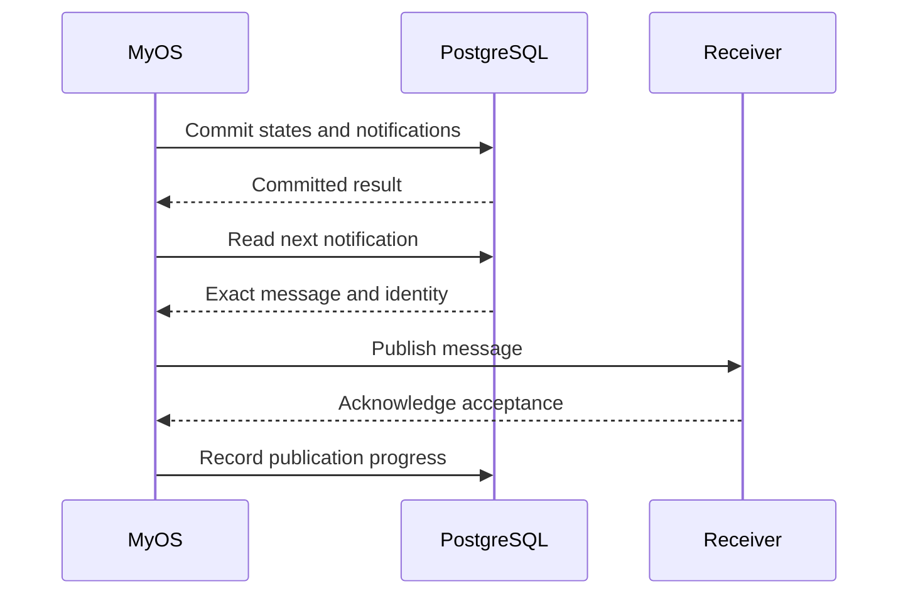

# 11. Saving a result and telling the outside world

> **Semantics:** r15.12 · **Status:** PostgreSQL outbox foundation verified; runnable general publisher integration is Phase3 · **Updated:** 2026-09-06

[Previous: crashes](10-crashes-and-resume.md) · [Tutorial map](README.md) · [Next: what the POC proves](12-what-the-poc-must-prove.md)

Agreement, or one consuming Order, has completed its own change. MyOS may need to publish an event
so that a client or another service can learn about that committed result. Agreement's notification
does not by itself claim that every Order has finished reacting.

Writing PostgreSQL and sending a network message are not automatically one atomic operation. If
MyOS sends first and then the database commit fails, the outside world sees a change that did not
become authoritative. If MyOS commits first and then crashes, an ordinary in-memory send can be lost.

## Save the intention to publish with the result

The implemented PostgreSQL foundation uses an **outbox**: a durable list of messages waiting to
be published. Its tests include lost acknowledgements and fresh-process publication. The general
MyOS processing/publisher service is not installed yet; the default application remains unchanged.

In the same transaction that saves that local result, its history, consumed cursor and completed
work, MyOS saves its exact notifications and outgoing obligations. A publisher reads the notification
records afterward. Agreement and its consumers have separate such transactions; delivery discovery
is durable even if the notifications have not yet been sent.

If the change creates/removes an embedding or changes work readiness, the same transaction also
updates its authoritative temporal dependency indexes and durable work basis. State, indexes and
work cannot disagree after a crash. An Agreement commit saves enough information to resume finding
its Orders; it does not enumerate 100,000 recipients or wait for them in this transaction.

The messages below are **operations over time**:

If MyOS crashes after the first commit, the pending notification is still in PostgreSQL.
It does not have to recalculate the document change to discover what to send.

The small real-library smoke cases already exercise that saved-result/publish/restart boundary.
They use the narrow initialization adapter or explicit history/failure/import test bridges. Phase3
must connect the general adapter and repeatable publication/recovery loops through one runnable path;
a standalone database bootstrap is not that complete service.

## What if the acknowledgment is lost?

The receiver may have accepted the message even though MyOS did not get its acknowledgment. MyOS
then sends the same message identity again.

If the database commit response itself was lost, first reconcile the exact retained commit plan.
Do not recompute the document merely because the worker did not see an acknowledgement.

The receiver must durably recognize duplicates if the end-to-end requirement is “one observable
effect”. The outbox alone cannot give that guarantee to an arbitrary receiver that applies every
delivery again. Network retries and business-event multiplicity are different things: two distinct
events with identical payloads must still remain two events.

## Publication order follows committed semantic work

Notifications follow their declared semantic publication order, with durable predecessor authority.
Parallel independent consumers may commit in either physical order; that order is not a semantic
comparator. Each required publication stream preserves its authorized order, and any externally
observable combined ordering needs an explicit deterministic rule. A shared transport must not
invent that rule from queue priority, database winners or inherited source timestamps.

A processing step may emit no notification. That does not erase the step's completion or allow
later messages to bypass the required order.

Several documents can genuinely belong to one atomic feedback operation and share one receipt.
Their per-document message batches retain their own order; the network need not reproduce every
cross-document interleaving inside that operation. Conversely, several independent operations
returned by one evaluation still need separate commits. Neither a worker batch nor a shared hash
turns them into one global transaction.

## Forwarding through another document is not re-emitting its event

Now a document named Root embeds Order, and Order embeds Agreement. Agreement emits E; Order handles
E and emits a genuinely new F. In the ordinary reference, E is delivered through its frozen ancestor
chain: Order does not need to re-emit E for Root to receive it. In a simple control with no earlier
queued effects, Root receives E before F. Event provenance and occurrence multiplicity survive.

The implemented managed observation program preserves those original delivery and read sites;
actual warm/cold library tests cover nested propagation. An immediate-Order relay batch with only
Order's final state is not an equivalent replacement: it may lose an intermediate observation or
place a newly emitted event on the wrong side of already queued work. The general PostgreSQL
adapter must retain that library evidence, not reconstruct a guessed event list.

The selected observation program retains update, enqueue and delivery boundaries. Root composes the
relevant upstream projections sharing one reaction origin and runs its own reactions in the proper
FIFO, without rerunning Agreement or demanding a new Order emission of E. A flat E/F list is not a
complete answer; [chapter13](13-equivalence-and-reuse.md) gives a small FIFO example. A handler's
buffered preview is also not yet an installed creation-site view; later handlers observe installation
only after that boundary actually occurs.

Internal forwarding evidence is not a new public business emission. Whatever representation is
chosen must be committed with the appropriate complete result and recoverable outgoing authority.
The outbox prevents lost publication; it does not repair an incorrectly calculated delivery trace.

The same atomic database result may describe zero business lineages for metadata-only no-delivery,
one independent document, or several existing documents in one genuine cyclic workflow. Its receipt
authenticates every required publication stream and predecessor. This does not put all observing
Orders in the source transaction or require simultaneous delivery to external services.

## Keep the publication path small

To send the next message, the publisher should read that successor or a bounded page. It should not
load every remaining message, send one, then load the whole remainder again. A large backlog must
not turn a simple sequence into repeated scans of the same data.

This is implemented for ordinary and activated historical-prefix batches. A short page caused by a
byte limit is not proof that history ended; a prefix blocked by a dependency cannot be skipped in
favor of its live tail. Oversized work holds with an explicit capacity reason instead of returning
an empty successful page forever. Staging a prefix alone permits no notification: its exact sealed
root must first be activated by the authorized commit.

MyOS uses the same principle when selecting document work: indexed recipient pages, indexed ready
work, and reverse indexes from an available dependency to its waiting work. It does not inspect all
documents or every document of a user to decide what to run next. Queue layout, batching and worker
allocation are host choices; complete delivery, semantic order and deterministic gas are not.

## Do all Orders need one final acknowledgment?

No. MyOS must durably account for each due reaction and retain unfinished work, but a single global
"all Orders finished" receipt is optional reporting/test bookkeeping. It creates no document epoch,
Contracts operation or additional semantic gas. Agreement and healthy Orders do not wait for it.

Suppose all currently found Orders finish, then a later index-coverage check confirms there are no
more eligible recipients. A dashboard may now report completion; that report does not commit the
documents again. It must not infer completion merely from an empty queue, and it must distinguish
successful reactions, terminal failures and unfinished work.

With 100,000 Orders, MyOS may need time to drain the real reaction workload. Bounded batches,
concurrency and memory, backpressure and fair scheduling protect the rest of the platform. Prompt
Agreement publication and total fanout completion are separate measurements, not one fixed deadline.

**Check your understanding:** does “the database committed” mean the client has already received
the event? No. The result is authoritative; durable publication can complete afterward without
changing the document history.

For the exact tested scope and the remaining application work, see the
[readiness record](../implementation/phase-1-2-readiness.md) and [Phase3 plan](../25-phase-3-integration-plan.md).
