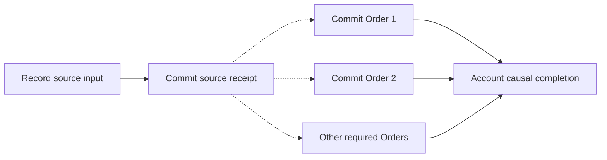

# 12. Put the pieces together, then test them

> **Semantics:** r15.12 · **Status:** agreed pre-Phase3 repairs verified; Phase3 remains planned · **Updated:** 2026-09-06

[Previous: notifications](11-from-database-to-notification.md) · [Tutorial map](README.md) · [Next: equivalence and reuse](13-equivalence-and-reuse.md)

Here is the ordinary managed example in one pass. Agreement receives an approval request. Coordination
proves its next input, and Contracts computes its local source result. MyOS commits that result with
a retained receipt and durable delivery-discovery authority. Each eligible Order consumes the proper
receipt and commits its own result, cursor and outgoing obligations. Independent Orders may run in
parallel; each required history still has exactly one allowed order.

The libraries and PostgreSQL foundation implement the main boundaries, including the verified
[review repairs](../implementation/pre-phase-3-review-remediation.md). The complete
Agreement/Orders path still needs the general MyOS adapter. The diagram is that target flow,
not a claim that the unchanged default application already runs it.

Arrows here mean **causal dependencies between complete operations**, not one large transaction:

The fan-in shows an **optional aggregate progress report**, not a required global receipt or a barrier
holding commits until the last Order finishes. The host must durably account for each entitled reaction,
whether or not it exposes that report. It uses transactionally maintained historical relationship
indexes and indexed ready work, not a scan of every document or a reconstruction of history for each
event. Source commit preserves the durable basis for discovering all recipients later in bounded
pages. Each local result can publish notifications under its declared publication order.

## Our reference uses the reviewed logical boundaries

First derive the required observations, update/event order, gas and failure from actual Contracts
and the accepted logical operation. Use the tiny [chapter 13](13-equivalence-and-reuse.md) examples
to test source reuse against ordinary processing. Then compare eager and lazy PostgreSQL-backed
executions under the same verified logical input and ownership mapping.

Independent source ownership can change the boundary relative to one Root containing all observers.
That mapping must be explicit and reviewed; it does not authorize losing intermediate observations,
changing a gas outcome, or replacing ancestor delivery with a guessed one-hop rule. A candidate
eager model agreeing with a candidate lazy model proves neither against the actual semantics.

Ordinary inline content belongs to its owner's local operation. Shared writes, explicit synchronous
operations and cyclic feedback use the selected directed SCC boundaries. They cannot silently pull every
connected consumer back into one atomic group or use worker order to choose semantics.

## A small set of questions with sharp answers

| Test story | What must be checked |
|---|---|
| Agreement changes; Order reacts | independent complete commits; source receipt and durable discovery cannot be lost |
| Same authored Agreement and accepted history basis, warm/cold/reconstructed storage or reversed worker order | identical required initialization observations and gas; parent reaction and physical work accounted separately |
| One Agreement, 1,000 / 10,000 / 100,000 Orders | one committed source transition; bounded independent consumer work, fair service to other users; total propagation may take longer with N |
| Order 37 is missing content or exceeds gas | source and other Orders remain committed; exact local hold/failure is retained |
| External loop fails; detach; new loop input | failed state/epochs roll back; exact terminal input accounting permits later eligible repair, not retry-as-success |
| Order exceeds gas on r1:0→1, then processes r2:1→2 | retain view0; one r2 operation aligns0→1 then replays1→2, with shared rollback/gas and no original r1 event replay |
| Agreement patches x 0→1→2, parent watches `/b/x` | parent observes `[1,2]`; final-only replacement cannot stand in for authored updates; also check 0→1→0 |
| Source emits E1/E2; its handlers change x | derive the exact read at each delivery site from real FIFO; do not assume either `[1,2]` or a final-pinned `[2,2]` without the actual queue trace |
| One handler buffers patches x1/x2 and emissions E1/E2, without self-reactions | control derives final-value reads from actual buffering rules, not informal statement order |
| Parent(E1) emits P1; source(E2) emits F2 | preserve P1 before F2 in the specified ordinary FIFO; a flat pre-enqueued source batch is insufficient |
| Two external entries versus two internal events in one invocation | distinct successful epochs give Root F1→1/F2→2; internal E1/E2 can queue F1/F2 behind E2, so later F1 reads current Parent.y=2 while its immutable payload remains 1 |
| Same receipt, two placements and cross-alias reads | canonical sequential updates: /left handler reads /right0; later event reads1 after both updates; preserve frozen/cutoff behavior |
| An imported event creates a new historical placement | initialization/initial view is synchronous; historical epochs are separate ordered work; creator never sees a fabricated caught-up shadow or waits on its own commit |
| Root embeds Order embeds Agreement; Order(E) emits F | preserve ordinary frozen-ancestor delivery, original E provenance, exact reads and queue order; no compulsory immediate-parent relay assumption |
| Source commits count 1 at T10 and 2 at T20; Order reads at T15 | delayed Order reads 1 through its pinned revision, then consumes its later history |
| Source runs ahead of an earlier consumer attachment/removal | historical occurrence selection finds the right deliveries; no premature closure from stale topology |
| Source append races with occurrence registration | exact retained-position/continuing-cursor handoff; no lost or duplicated application |
| Relevant content arrives in pieces | same local history after retries; missing content is not absence |
| M1 commits while selected M2 execution data is missing | a fresh JVM acquires and completes only M2; corrupt bytes reject; missing selection authority is a separate wait |
| Later input arrives first | canonical microsecond order and complete local prerequisites still win |
| Existing Order waits; another Order attaches later | shared receipt-consumption principle, different exact activation/history selection |
| Initial source changes at 10/30, Order reads at 20 | chronological FULL_HISTORY records 1; direct child read and parent shadow tested separately |
| Catch-up generates feedback into a shared source | explicit causal/write boundary; no retroactive source rewrite or worker-order arbitration |
| K100 attaches and imports old E10, generating new F | K100 owns the new obligations; original E10 provenance survives and its closed computation stays closed |
| Passive reference cycle changes exact representation | coherent cyclic encoding stabilizes without synthetic business-receipt or gas-epoch loops |
| Crash at either local commit; publication ACK lost | no lost obligations, duplicate imports or duplicated observable message effect |
| Some consumers finish while delivery discovery remains open | source latency is separate; if aggregate status is reported, it cannot declare all work done early |
| Millions of documents; thousands active for one user; few ready | indexed recipient, ready-work and reverse-wait queries find only relevant work; unrelated documents are not scanned |
| Order's TO is unavailable while Agreement's TA is complete | reverse observer TO cannot block Agreement; real directed fan-in still requires its relevant completeness |
| No-delivery, one independent document, two existing coupled documents | zero/one/many business projections, exact stream predecessors and one atomic receipt for the owned result |

Each decisive integrated scenario needs a short English card: purpose, starting state, actions, exact expected
trace, durable result, forbidden outcomes, failure points and measured budgets. Independent expected
histories must include every original input, required reaction and cursor-only decision. The tutorial
is an explanation, not evidence that every row has passed through the general adapter. Existing
named executable tests and their reports are retained separately from a complete scenario-manifest archive.
Canonical source initialization and FULL_HISTORY are independent of the first Order; FROM_NOW and
FROM_FRONTIER select observer history/initial view. Source and parent have separate fixed gas scopes,
cold or warm. Failed r1/r2/D30 uses explicit alignment inside the next import; if both fail, detach
runs after their terminal outcomes. Physical import ranges never choose skips, budgets or all-or-nothing
business behavior. Actual library tests now prove these selected changes in the recorded scope. Ordinary successful
catch-up is uncoalesced; other failure statuses retain their own laws. Safe holds are not positive proof.
The controlling [processing kernel](../22-processing-kernel.md) fixes the target algorithm.

## What is ready now, and what comes next?

1. **Phase1 — libraries:** implemented and verified in the documented scope. Actual interpreter
   and cold-evidence tests cover independent groups, feedback, source reuse, initialization,
   historical views and recognized terminal failure. This is not a released or frozen API.
2. **Phase2 — PostgreSQL foundation:** 66 host tests and seven actual-library smoke cases passed.
   They cover atomic plans, recovery, Timeline/index primitives, history prefixes and publication.
   The seventh case proves the M1/M2 fresh-process boundary above. Only single-lineage initialization
   uses the narrow real adapter; other combined cases use explicit test bridges. The default MyOS
   application is not the new general durable host.
3. **Phase3 — planned, not started by this document:** install one runnable general adapter and
   ingress/recovery/discovery/publication loops. Extend it from a counter to small graph stories,
   then crash/adversarial schedules, then representative examples and calibrated performance runs.
   Keep the same adapter throughout instead of building a disposable bridge for each demonstration.

The [readiness record](../implementation/phase-1-2-readiness.md) retains exact counts, reports and
known limitations; [the Phase1 summary](../24-phase-1-library-summary.md) explains what changed;
[the Phase3 plan](../25-phase-3-integration-plan.md) sets the next implementation/verification sequence.
The final seven-case smoke takes 22 seconds including setup and cold recovery, not a promised
application latency. Millions of synthetic metadata rows prove access paths, not that many real
workflow executions. Prefix activation currently has a bounded dependency-source/control capacity;
a 10,000-source authored graph may hold and needs measurement, not a false success label.

Run the affected test and small story after each change, the impacted regression once at a stable
checkpoint, and the decisive correctness/fault/performance packs on the final candidate. Reuse
unchanged evidence and serialize shared library builds. Do not hide a failed measurement or rewrite
an expected history merely to turn a test green.

Measure source-commit latency and consumer throughput/lag separately. The change in Agreement should
commit quickly without waiting for all Orders. Required N reactions legitimately cost processing
and gas; the whole fan-out has no universal seconds-scale deadline. The platform must remain bounded
and stable while it drains that work, including service to unrelated users. A cold cache or retry
does not create additional logical gas. Count avoidable copying/reverification separately from the
necessary reactions authored by the user.

Whole-cause completion is optional reporting. If provided, it needs complete discovery and every
required reaction accounted for, including failures; no mandatory global terminal receipt is needed.
Use consistent historical indexes and their completeness rules so an admitted-but-not-yet-materialized
Order is not omitted. Test indexed discovery and scheduling on million-document corpora too.
An unfinished measurement is a lower bound, not a completed latency sample proving a fast p99.

Passing the first POC will not make the API final. If correctness fails, fix the owning model or
implementation. If it is correct but slow, optimize measured costs without changing the required
per-lineage histories or hiding work behind a narrower success metric.
