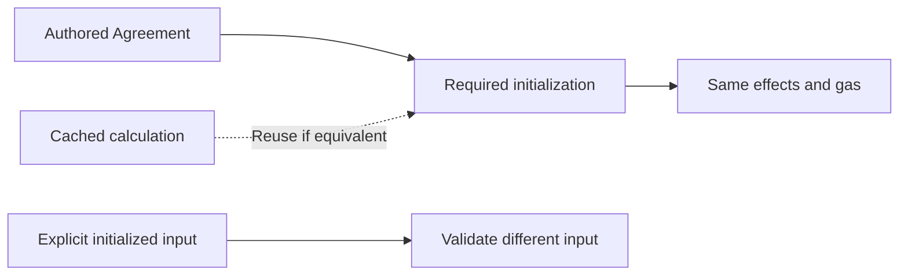
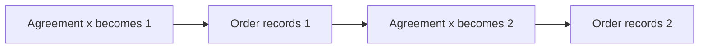

# 13. Same behavior, less repeated work

> **Revision:** 15.12 · **Status:** design requirement and hand-derived examples; not executed test evidence

[Tutorial map](README.md) · [Previous: what the POC proves](12-what-the-poc-must-prove.md)

The goal is not to invent different Order behavior. It is to preserve the behavior while loading
less data and calculating a shared Agreement fewer times. The small stories below explain why
this needs more than saving Agreement's final value.

## First: three different things called “already initialized”

Imagine an authored Agreement whose initialization changes `x` from 0 to 1 and emits `Ready`.
An Order observes that initialization and records `readySeen=true`.

| What is available | What processing must decide |
|---|---|
| The authored Agreement | derive its fixed canonical source-local initialization, including required observations |
| A cached calculation of that initialization | reuse work only if it reproduces those same observations and gas |
| An explicitly supplied initialized Agreement | accept only with authority for the same canonical result and selected view; never invent another source origin |

In the second row, the cache is an implementation detail. It cannot make `readySeen` stay false
because MyOS silently substituted the third row and skipped initialization. Nor can it make the
same operation cheaper in semantic gas. A physically rebuilt result is not a second document birth.

The authored value determines the lineage's identity; the frozen environment fixes its canonical
initialization and FULL_HISTORY. FROM_NOW@T10 and FROM_NOW@T20 choose different **observer** histories,
not different source histories. Source X retains E15 either way. A winning SQL insert cannot choose
that basis. Source initialization and parent consumption have separate fixed budgets, even cold;
source gas settles once at authorized publication, not again after cache reconstruction.

This diagram distinguishes input/evidence categories, not alternative source-origin policies.
“Validate different input” requires canonical authority; it does not authorize another history:

## Example A: two updates inside one operation

Order A embeds Agreement at `/b`. A watches changes to `/b/x` and appends the value it reads to
its own `log`. Agreement applies two patches in one handler: `x:=1`, then `x:=2`. No business event
or feedback is needed.

Ordinary Contracts applies one patch, runs its required Document Update reactions, then continues:

The required log is `[1,2]`. Replacing the whole `/b` with final `x=2` is not those two `/b/x`
updates. A narrow `/b/x` watcher may not match that replacement at all. Comparing just the final
Agreement value misses the error. The variation `x:0→1→0` is stronger: even unchanged final business
data can conceal two meaningful observations. Other state, such as a checkpoint, may still change.

## Example B: the event handler can change the value before its parent reads

This example uses **one Timeline input and two internal events in its operation**, not two Timeline
entries producing two source epochs. Agreement starts with `x=0`. Its external handler emits E1 and
E2. Agreement also has its own
Triggered handlers: on E1 it sets `x=1`; on E2 it sets `x=2`. Order records `/b/x` whenever it
receives either Embedded Event. Neither document writes the other's state.

| Logical step in the ordinary FIFO | Agreement x | Order log |
|---|---|---|
| Agreement handles its E1 | 1 | empty |
| Order observes E1 | 1 | `[1]` |
| Agreement handles its E2 | 2 | `[1]` |
| Order observes E2 | 2 | `[1,2]` |

If MyOS calculates Agreement all the way to 2, then gives Order `[E1,E2]` while exposing only that
final state, Order records `[2,2]`. The event list is complete; the observation context is wrong.

There is an important control. If one handler only buffers two patches and two emissions, with no
subsequent self-reactions, Contracts applies its patches before its emissions. Both event handlers
may correctly read 2. We must specify the real handlers and processing phases, not infer behavior
from informal “emit E1, change x, emit E2” wording.

## Example C: preserving event order needs admission boundaries

Agreement emits E1 and E2. Order reacts to E1 by emitting its own P1. Agreement's own E2 handler
emits F2. In the ordinary FIFO:

1. E1 and E2 are already queued.
2. E1 is handled; Order adds P1 behind E2.
3. E2 is handled; Agreement adds F2 behind P1.
4. P1 is handled before F2.

Now precompute Agreement and enqueue its complete flat event list `[E1,E2,F2]` for Order. Order's
P1 is created while handling E1, so it is appended behind the already queued F2. The order is wrong.
Order can expose the difference by logging its own P1 delivery and its embedded F2 delivery.

This does not require a cycle. A complete list of events is not necessarily a complete description
of when each event joined the queue.

## Example D: why two inputs are different from two internal events

First use two separate Timeline inputs in `Root → Parent → Source`:

1. Input I1 changes Source to 1 and creates its next successful epoch. Parent's corresponding
   complete reaction sets y=1 and emits F1. Root's F1 reaction reads the corresponding Parent view 1.
2. Input I2 changes Source to 2 and creates its following successful epoch. Parent's later reaction
   sets y=2 and emits F2. Root's F2 reaction reads Parent view 2.

The result is **F1 reads 1, F2 reads 2**, even if the database already stores Parent's later head when
Root starts. Physical lateness must not change Root's historical view.

Now change only the input structure: **one operation** already has internal E1 and E2 in its FIFO.
Parent reacts to E1 by setting y=1/emitting F1, and to E2 by setting y=2/emitting F2.

| Step | Remaining FIFO | Parent y |
|---|---|---:|
| E1 and E2 are admitted | E1, E2 | 0 |
| Parent reacts to E1 and appends F1 | E2, F1 | 1 |
| Parent reacts to E2 and appends F2 | F1, F2 | 2 |
| Root handles F1 | F2 | 2 |
| Root handles F2 | empty | 2 |

Here the result is **F1 reads 2, F2 reads 2**. F1 cannot jump ahead of E2 merely because it was caused
by E1. If F1 carries a payload `value: 1`, that payload is still 1; reading Parent y is a different
observation. Internal events do not each create a new epoch. The two stories have different logical
inputs, so their different observations are not nondeterminism.

## What must the retained evidence preserve?

Enough to reproduce the observations above: exact intermediate views when they are observable,
authored update paths and order, event admission/handling boundaries, original event identities,
applicable routes, and semantic gas. The final evidence format is not defined by this tutorial.
It need not be a full VM trace; it must be sufficient to pass independently derived examples.

This does not require loading 1,000 Orders to process Agreement. The intended saving is to compute
reusable source behavior once, retain the necessary evidence, and let each independent Order load
what its own reaction needs. Source execution, evidence replay, each Order's rules and physical
I/O are different costs. Removing a required semantic gas charge is not a speed optimization.
If 100,000 Orders genuinely react, the platform must execute that work efficiently and fairly; no
fixed few-seconds deadline applies to the entire fan-out at every size. Agreement's independent
commit must remain separate from that backlog. MyOS must maintain consistent relationship/work
indexes and use bounded batches, memory and concurrency instead of scanning all documents or
loading every Order at once. Index and scheduler choices belong to the host; reliable, efficient
identification and execution of due work are required integration properties.

## What is atomic, and what may finish later?

One atomic workflow retains its queue, gas and rollback rules until it finishes or fails. A cycle
inside that workflow does not receive fresh gas on every persisted hop. Later Timeline inputs do
not overtake its unfinished required reactions. Multiple Orders need not become one transaction
merely because they share a source; the ownership mapping must nevertheless be explicit.

Independent source publication means an Order failure does not undo an already authoritative
Agreement. That differs from rolling back one combined Root containing both. We must establish
which logical document each history/result belongs to, not call the difference “just persistence”.
The selected directed SCC rule makes that ownership difference explicit; one-way reverse observers
do not join the source's operation. Two new interpreters agreeing with each other still do not replace
independent tests of required per-document observations.

## Why this matters for a newly created embedding

A workflow creates `/b`, then reads its own `counterB`, which a child reaction is supposed to set.
Reading Agreement's exact `x` directly and reading Order's event-derived `counterB` are different.
The selected managed API makes initialization and its initial/boundary view available synchronously.
Historical source epochs instead run as separate ordered operations. Until those reactions run,
the creator's `counterB` is not magically updated. A creator read sees the actually installed view
and parent state; waiting for its own uncommitted successor is not part of this algorithm.

## Example E: a failed Order does not stop forever

Agreement has independently committed values r0=0, r1=1 and r2=2. Order's reaction to r1 exceeds gas.
Its state, epoch and imported view remain at r0, while MyOS durably records r1's terminal failure.
The selected proposal then allows the next r2 delivery to run from that real rollback state after
Coordination verifies the original r0→r1→r2 history and failed-r1 disposition.

The next r2 operation first aligns Order's reference0 to r2's exact before1 through an ordinary
containing update, then replays r2's own1→2 observations. Both phases share one gas/rollback boundary.
An event before r2's first patch reads1. Original r1 events are not replayed; alignment can cause new
Order update reactions. It creates no source receipt or successful consumer r1 epoch. A local read
between failed r1 and r2 instead sees the unchanged embedded0.

Alignment itself may trigger the same faulty handler and fail again, even if r2 would end at2.
If r2 exceeds gas, it is accounted for too; a later canonically due detach input can break
the faulty relationship. Missing data is different: it is a wait, not permission to consume an input
as failed. None of this splits a genuinely atomic cyclic workflow, and normal successful historical
steps still retain their own boundaries and all required observations.
Continue the canonical operation sequence, not a worker page: no remaining range is discarded after
first failure. Later successful operations may have business effects; a fixed attachment lane can
finish with failures and must report them honestly.
This selected failure rule applies to `GAS_LIMIT_EXCEEDED` and recognized deterministic semantic
`RUNTIME_FATAL`. Other statuses keep their own processing rules. Missing data, timeout, cancellation
and unknown implementation exceptions are not terminal import outcomes.

Phase1 implements this continuation with exact failure evidence and source-before alignment.
The [readiness record](../implementation/phase-1-2-readiness.md) lists the executed controls;
the general application adapter and full end-to-end scenario set remain Phase3 work.

These examples are the starting cards for verification, not newly passed tests. Source anchors,
the selected algorithm are in [document22](../22-processing-kernel.md).

**Check your understanding:** does “same final Agreement and same event payloads” prove equivalent
processing? No. The Order may have observed different values or a different event order along the way.
